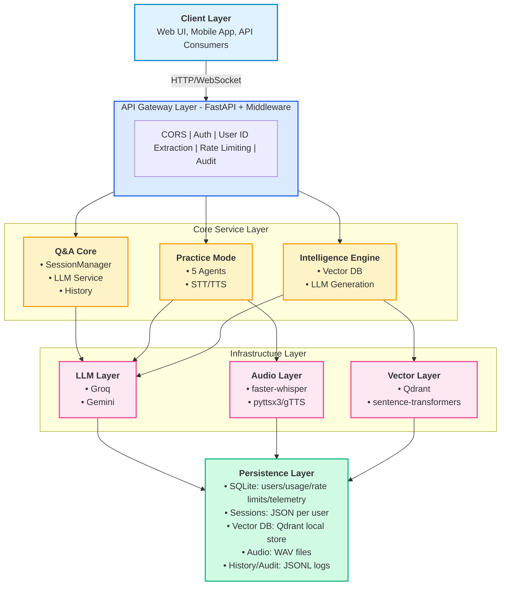
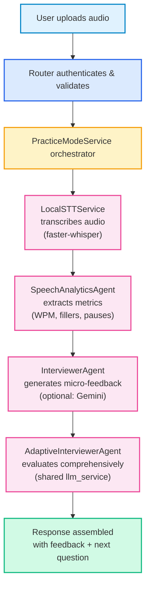
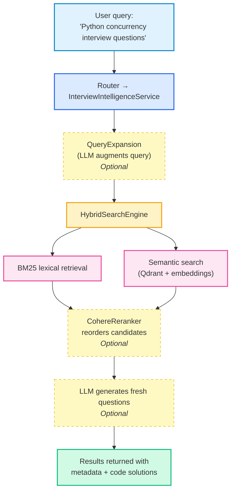

# Stratax AI
## Backend Technical Architecture & System Design

---

**Version:** 1.0  
**Date:** January 2026  
**Organization:** Stratax AI Development Team  
**Classification:** Technical Architecture Document

---

<div style="page-break-after: always;"></div>

# Executive Summary

## Overview

Stratax AI is an advanced AI-powered interview assistant platform that leverages large language models (LLMs), vector databases, and speech processing to provide comprehensive interview preparation and technical evaluation capabilities. The backend service is architected as a modern, scalable FastAPI application that orchestrates multiple AI subsystems to deliver real-time interview coaching, intelligent question generation, and automated code evaluation.

## Problem Statement

Technical interview preparation faces several critical challenges:
- **Lack of personalized feedback** on communication delivery and technical accuracy
- **Limited access** to company-specific and domain-targeted interview questions
- **Insufficient real-time coaching** during practice sessions
- **No systematic evaluation** of coding solutions with actionable improvement suggestions

## Solution Architecture

Stratax AI addresses these challenges through a multi-layered backend architecture:

1. **Intelligent Q&A Engine** — Context-aware conversational assistant powered by Groq and Gemini LLMs
2. **Practice Mode** — Real-time audio-based interview simulator with speech analytics and micro-feedback
3. **Interview Intelligence** — Vector search and LLM-driven question generation with optional web augmentation
4. **Code Evaluation** — Static analysis combined with LLM critique for comprehensive code review
5. **Architecture Generation** — Automatic system diagram creation from code analysis

## Key Capabilities

- **Multi-provider LLM abstraction** supporting Groq and Google Gemini with hot-swappable configuration
- **Local speech processing** using faster-whisper (STT) and pyttsx3/gTTS (TTS) for offline practice
- **Hybrid retrieval system** combining BM25 lexical search with semantic vector search via Qdrant
- **Agent-based architecture** with specialized components for interviewing, evaluation, and speech analytics
- **Company-specific interview preparation** with targeted question generation
- **Real-time feedback loops** with micro-coaching on delivery metrics (pace, fillers, confidence)
- **Telemetry-driven personalization** using a structured event stream (privacy-safe stable hashes) and deterministic learning loops for recommended practice focus areas

## Technology Foundation

**Runtime:** Python 3.12 + FastAPI + Starlette  
**AI/ML:** Groq SDK, Google Generative AI, sentence-transformers, faster-whisper  
**Storage:** SQLite (`data/stratax.db`) for structured records (users/usage/rate limits/telemetry), Qdrant vector DB for semantic retrieval, plus file-based JSON/JSONL persistence for sessions/audit logs  
**Deployment:** Docker containerization with docker-compose orchestration  
**Audio:** librosa, soundfile, pyttsx3, gTTS

## Target Users

- **Engineering Teams** integrating AI interview capabilities into products
- **Platform Developers** building interview preparation services
- **Technical Architects** evaluating AI-driven coaching systems
- **DevOps Engineers** deploying and scaling the service

<div style="page-break-after: always;"></div>

# System Overview

## Backend Responsibilities

The Stratax AI backend serves as the central orchestration layer for all interview intelligence operations. Core responsibilities include:

### Primary Functions

1. **Session Management** — Per-user conversational context with persistent history
2. **LLM Orchestration** — Provider-agnostic request routing with fallback handling
3. **Vector Search** — Semantic question retrieval using embedding-based similarity
4. **Audio Processing** — Transcription, synthesis, and delivery metric extraction
5. **Evaluation Pipeline** — Multi-stage assessment of answers and code submissions
6. **Diagram Generation** — Architecture visualization from code analysis

## Recent Updates (Past Week)

### Telemetry & learning loops

- Added a structured telemetry spine using a database-backed `event_records` stream (SQLAlchemy `EventRecord`).
- Events use privacy-safe stable identifiers (SHA256 or HMAC-SHA256 when configured) and avoid raw text storage by default.
- Introduced deterministic “learning loops” that aggregate recent practice events into explainable insights.
- Exposed `GET /api/practice/insights` to return summary stats and `recommended_focus` for personalization.

### Interview Intelligence: key policy + history correctness

- Enforced `REQUIRE_USER_API_KEY` behavior: when enabled, Interview Intelligence requests without a client-supplied key return **401** (no silent fallback).
- Prevented duplicate history entries by disabling backend auto-save for standard Interview Intelligence search; the UI should save exactly once through the History API.

### Code Studio execution + Visualize (backend sandbox)

- Added a dedicated LeetCode-style execution endpoint: `POST /api/code/execute`.
- Execution is server-side via sandbox providers (Judge0 via RapidAPI with optional fallback providers).
- Supports `stdin`, optional `test_cases`, and tracing.
- Tracing can optionally attach per-line explanations (`explain_trace`) to support a “Visualize” UI.

### Production secrets + encrypted provider keys

- Production now requires persistent `JWT_SECRET_KEY` and `COOKIE_SECRET` (to avoid token/cookie invalidation on restart).
- Added encryption for user-stored provider keys using `STRATAX_SECRETS_ENCRYPTION_KEY` (Fernet), stored in DB with an `enc:` prefix.
- Backward compatible: plaintext rows can still be read, but production refuses to store new provider keys unless encryption is configured.

### CI (GitHub Actions)

- Added `.github/workflows/ci.yml` to run `pytest -q` on push/PR.
- CI sets safe flags (`FAST_STARTUP=true`, `DISABLE_INTERVIEW_INTELLIGENCE=true`, `ENABLE_CODE_EXECUTION=false`) and uses fixed test secrets.

### Service Architecture

The system is designed as a **monolithic FastAPI service** with optional modular components:

- **Always Available:** Q&A engine, session management, health endpoints
- **New:** Auth subsystem (JWT + optional Google OAuth) backed by SQLite (`data/stratax.db`)
- **New:** Tier-based rate limiting middleware (plus demo-mode quotas + debug headers)
- **Optional Components:**
  - Interview Intelligence (requires Qdrant and sentence-transformers)
  - Practice Mode (requires audio libraries and TTS/STT models)
  - Code Execution Sandbox (requires Judge0 or Piston API)

### Deployment Model

**Single Service Container** running on port 7860 with:
- Single worker process (Qdrant lock constraint)
- Lifespan-managed initialization of shared components
- File-system persistence for sessions and vector indices
- Optional Kroki sidecar for Mermaid rendering

### Subsystem Organization

```
FastAPI Application
├── Core Q&A Engine
│   ├── Session Manager (per-user state)
│   ├── LLM Service (provider routing)
│   └── History Manager (JSONL logging)
│
├── Practice Mode (Optional)
│   ├── Interview Orchestrator
│   ├── Speech Analytics Agent
│   ├── Adaptive Interviewer Agent
│   ├── Conversational Agent
│   ├── Evaluation Agent
│   ├── Local STT Service (faster-whisper)
│   └── Local TTS Service (pyttsx3/gTTS)
│
├── Interview Intelligence (Optional)
│   ├── Vector Store (Qdrant + embeddings)
│   ├── Question Generator (LLM)
│   ├── Hybrid Search Engine (BM25 + semantic)
│   ├── Cohere Reranker (optional)
│   ├── Query Expansion (LLM-based)
│   └── Code Execution Sandbox (optional)
│
├── Mock Interview
│   ├── Session Persistence
│   ├── Progressive Hints
│   └── LLM Evaluation
│
├── Code Evaluation
│   ├── Static Analysis
│   ├── LLM Critique
│   └── In-memory Cache
│
└── Architecture/Diagram Generator
    ├── Mermaid Sanitization
    ├── Complexity Detection
    └── Optional Kroki Rendering
```

<div style="page-break-after: always;"></div>

# Architecture Overview

## High-Level Component Interaction



## Request Flow Example: Practice Mode Audio Submission



## Data Flow: Interview Intelligence Search



<div style="page-break-after: always;"></div>

# Technology Stack

## Runtime & Framework

### Core Platform
- **Python 3.12** — Modern async/await support, performance improvements
- **FastAPI** — High-performance async web framework with automatic OpenAPI documentation
- **Starlette** — ASGI toolkit for routing, middleware, and WebSocket support
- **Uvicorn** — Lightning-fast ASGI server for production deployment
- **Pydantic** — Data validation and settings management with type safety

### Configuration Management
- **pydantic-settings** — Environment-based configuration with `.env` support
- **python-dotenv** — Secure secrets management via environment variables

## AI & Machine Learning

### Large Language Models
- **Groq SDK** — Ultra-fast inference with Llama and Mixtral models
- **Google Generative AI (Gemini)** — Multimodal capabilities, large context windows

*The system provides a unified abstraction layer allowing hot-swappable provider selection via configuration.*

### Embeddings & Vector Search
- **sentence-transformers** — State-of-the-art semantic embeddings (all-MiniLM-L6-v2)
- **torch (CPU build)** — PyTorch runtime optimized for CPU inference
- **Qdrant** — High-performance vector database with HNSW indexing

### Retrieval Augmentation
- **LangChain Community** — BM25 retrieval, vectorstore abstractions, text splitters
- **rank-bm25** — Lexical search for hybrid retrieval
- **Cohere API** — Neural reranking for search result optimization

### Speech Processing
- **faster-whisper** — OpenAI Whisper optimized for CPU with CTranslate2
- **pyttsx3** — Offline text-to-speech (Windows SAPI, macOS NSSpeechSynthesizer, Linux espeak)
- **gTTS** — Google Text-to-Speech fallback for cloud-based synthesis
- **librosa** — Audio feature extraction for speech analytics
- **soundfile** — Audio I/O operations

### Agent Architecture
The Practice Mode subsystem implements a multi-agent pattern:
- **InterviewerAgent** — Question sequencing and micro-feedback
- **SpeechAnalyticsAgent** — Delivery metrics via DSP (not LLM-based)
- **AdaptiveInterviewerAgent** — LLM-driven answer evaluation
- **ConversationalAgent** — Profile inference from natural language
- **EvaluationAgent** — End-of-interview coaching reports

## Storage & Persistence

### Primary Storage
- **File System** — JSON/JSONL for sessions, history, and configuration
- **Qdrant (Local Mode)** — Embedded vector database for interview questions

### Persistence Strategy
- User sessions: `data/sessions/{user_id}/{session_id}.json`
- Vector indices: `data/interview_intelligence_v2/vector_db/`
- Audio recordings: `data/practice_audio/` (WAV format)
- Model cache: `data/models/` (sentence-transformers downloads)

*Note: File-based architecture chosen for simplicity; DB migration path available for scaling.*

## External Integrations (Optional)

- **Serper API** — Web search for real-time interview question sourcing
- **Judge0/Piston** — Code execution sandboxes for safe code evaluation
- **GitHub API** — Repository search for technical question curation
- **Kroki** — Mermaid diagram rendering service

## Containerization

- **Docker** — Single-service container with Python 3.12 slim base
- **docker-compose** — Multi-container orchestration (app + Kroki)

<div style="page-break-after: always;"></div>

# Core Capabilities & Modules

## 1. Q&A Engine

### Purpose
Conversational AI assistant for technical interview preparation with persistent session context and multi-turn conversation support.

### Key Responsibilities
- Session lifecycle management (create, list, delete, title updates)
- LLM request orchestration with provider selection
- Conversation history persistence per user
- Profile upload and context enrichment (resume/job description analysis)

### Architecture Pattern
```
User Request → Router → SessionManager → LLM Service → Response
                  ↓
            Per-user JSON persistence
```

### Notable Features
- **API key flexibility:** Accepts user-supplied keys or falls back to server configuration
- **Streaming support:** Optional response streaming for real-time UX
- **Identity guard:** System prompt enforces attribution to prevent AI impersonation

---

## 2. Practice Mode

### Purpose
Real-time audio-based interview simulator with comprehensive speech analytics, micro-feedback, and end-to-end evaluation.

### Key Responsibilities
- **Round-based interviews:** Pre-configured rounds (HR, Technical, System Design) with dynamic question generation
- **Quick-start onboarding:** Conversational AI infers user profile from natural language
- **Audio processing:** Local STT transcription with Voice Activity Detection (VAD)
- **Speech analytics:** Delivery metrics (WPM, fillers, pauses, pitch variance, confidence scoring)
- **Micro-feedback:** Immediate coaching tips (< 15 words each) on delivery
- **Comprehensive evaluation:** Per-answer technical accuracy scoring with actionable suggestions
- **Final report:** End-of-interview coaching with strengths, improvements, and action plan

### Multi-Agent Architecture
```
PracticeModeService (Orchestrator)
    ├─ LocalSTTService → Transcription
    ├─ SpeechAnalyticsAgent → Delivery metrics
    ├─ InterviewerAgent → Question bank + micro-feedback
    ├─ AdaptiveInterviewerAgent → Answer evaluation (LLM)
    ├─ ConversationalAgent → Profile inference (LLM)
    └─ EvaluationAgent → Final coaching report (LLM)
```

### Workflow
1. **Start:** User initiates via quick-start or round selection
2. **Question Presentation:** Question delivered with optional TTS audio
3. **Answer Submission:** User uploads audio answer
4. **Processing:** STT → analytics → evaluation → micro-feedback
5. **Acknowledgment Gate:** User acknowledges feedback before next question
6. **Completion:** Final evaluation report generated with comprehensive coaching

### Differentiators
- **Local processing:** No cloud STT dependency (faster-whisper runs offline)
- **Dynamic filler detection:** Not hardcoded lists; detects repetitions, fragments, false starts
- **Company-specific preparation:** Generates questions tailored to Google, Meta, Amazon, etc.

---

## 3. Interview Intelligence

### Purpose
Semantic search and intelligent question generation system powered by vector embeddings and LLM augmentation.

### Key Responsibilities
- **Vector search:** Qdrant-based semantic retrieval with embedding similarity
- **Question generation:** LLM creates questions when database lacks sufficient results
- **Code solution backfill:** Automatically generates code solutions for technical questions
- **Source transparency:** Tracks question provenance (curated, generated, community)

### AI-Native Enhancement Pipeline
When feature flags enabled:
```
Query Input
    ↓
[QueryExpansion] ← LLM augments query
    ↓
[HybridSearchEngine] ← BM25 + Semantic fusion
    ↓
[CohereReranker] ← Neural reranking
    ↓
[CodeExecutionSandbox] ← Validate solutions
    ↓
Results + Metadata
```

### Hybrid Retrieval Strategy
- **Lexical (BM25):** Exact keyword matching for specific terms (e.g., "asyncio", "React hooks")
- **Semantic (Vector):** Conceptual similarity for natural language queries
- **Fusion:** Reciprocal rank fusion combines scores for optimal ranking

### Optional Enhancements
- **Web augmentation:** Serper API fetches real-time questions from web sources
- **Code execution:** Judge0/Piston validates code solutions in sandboxed environments
- **Streaming search:** WebSocket-based progressive result delivery

---

## 4. Mock Interview

### Purpose
Multi-question interview session simulator with progressive difficulty, hints, and LLM-based evaluation.

### Key Responsibilities
- Question sequence management (typically 5 questions per session)
- Progressive hint system (3 levels: gentle nudge → concept clarification → near-solution)
- Per-question timing and evaluation tracking
- Final summary with scores and improvement recommendations

### Persistence Model
- Active sessions: In-memory with periodic JSON persistence
- History: Long-term storage per user in consolidated JSON file

### Evaluation Flow
```
User submits answer
    ↓
LLM evaluates with temporarily increased token limit
    ↓
Score (0-100) + detailed feedback
    ↓
Persisted to session
```

---

## 5. Code Evaluation

### Purpose
Hybrid static + LLM analysis for code submissions with caching to avoid redundant evaluations.

### Key Responsibilities
- **Static analysis:** Code length, complexity heuristics, language detection
- **LLM critique:** Detailed feedback on correctness, style, optimization, edge cases
- **Context-aware classification:** Determines if code evaluation is appropriate for given conversation
- **Result caching:** In-memory cache keyed by session + context + code hash

### Architecture
```
Code Submission
    ↓
[Static Signals] → Metrics (lines, complexity)
    ↓
[LLM Service] → Detailed critique
    ↓
[Cache] → Store result
    ↓
Response with evaluation
```

---

## 6. Architecture & Diagram Generation

### Purpose
Automatic system architecture diagram generation from codebase analysis with Mermaid syntax output.

### Key Responsibilities
- **Complexity detection:** Analyzes code for architecture-worthy patterns (microservices, layering, event-driven)
- **Multi-view generation:** Creates Component, Deployment, Sequence, and Data Flow diagrams
- **Mermaid sanitization:** Strips CSS/HTML artifacts and repairs syntax errors
- **Optional rendering:** Kroki service integration for SVG/PNG export

### View Types
- **Component View:** High-level system components and relationships
- **Deployment View:** Infrastructure and hosting topology
- **Sequence Diagram:** Request/response flows for key operations
- **Data Flow:** Information movement through system layers

<div style="page-break-after: always;"></div>

# AI & Intelligence Layer

## LLM Abstraction Architecture

### Provider-Agnostic Design

The system implements a unified `LLMService` abstraction that decouples business logic from specific LLM providers. This design enables:

- **Hot-swappable providers** via configuration (`settings.llm_provider`)
- **Consistent interface** for both streaming and non-streaming responses
- **Fallback handling** when providers are unavailable or misconfigured
- **Per-request provider override** for multi-tenant scenarios

### Provider Implementation

```
LLMService (Abstraction)
    ├─ generate_answer() → Full conversation response
    ├─ generate_text() → Single completion
    └─ Provider Routing:
        ├─ Groq SDK → Ultra-fast inference
        └─ Gemini SDK → Large context windows
```

**Key Decision:** Groq chosen for speed (sub-second latency), Gemini for context length (1M tokens in latest models).

### Identity Guard System

All LLM prompts include a forward prompt (`CODE_FORWARD_PROMPT`) that enforces:
- **Attribution rules:** AI must never impersonate Stratax AI developers
- **Response formatting:** Structured output with sections (Answer, Code, Explanation)
- **Behavioral guidelines:** Professional tone, no disclaimers, actionable advice

## Agent Architecture (Practice Mode)

### Multi-Agent Orchestration

Practice Mode implements a **composite agent pattern** where specialized agents handle distinct responsibilities:

| Agent | Responsibility | LLM Usage |
|-------|---------------|-----------|
| **InterviewerAgent** | Question bank, sequencing, micro-feedback | Optional (Gemini direct) |
| **SpeechAnalyticsAgent** | Delivery metrics via DSP | None (pure signal processing) |
| **AdaptiveInterviewerAgent** | Answer evaluation (correctness, coverage) | Yes (JSON mode) |
| **ConversationalAgent** | Profile inference from natural language | Yes |
| **EvaluationAgent** | End-of-interview coaching report | Yes (JSON mode) |

### Why Multi-Agent?

**Separation of concerns:** Each agent has a single, well-defined purpose.  
**Independent scaling:** Can optimize/replace agents without affecting others.  
**Testability:** Each agent can be unit-tested in isolation.  
**Fallback resilience:** If LLM-based agent fails, rule-based fallbacks preserve core functionality.

### JSON Mode Enforcement

Several agents operate in **JSON mode** for structured output:

```python
AdaptiveInterviewerAgent.evaluate_answer_comprehensively()
    → Returns:
    {
      "correctness_score": 0-100,
      "technical_accuracy": "Excellent|Good|Fair|Poor",
      "key_points_covered": [...],
      "strengths": [...],
      "improvement_areas": [...],
      "actionable_suggestions": [...]
    }
```

**Challenge:** LLMs occasionally produce malformed JSON.  
**Mitigation:** Multi-stage JSON repair pipeline with regex-based fixing and manual extraction fallbacks.

## Retrieval-Augmented Generation (RAG)

### Hybrid Search Architecture

Interview Intelligence combines **lexical** and **semantic** retrieval for optimal question discovery:

```
Query: "Explain Python GIL"
    ↓
┌─────────────────────┬─────────────────────┐
│   BM25 (Lexical)    │  Semantic (Vector)  │
│                     │                     │
│ Exact match: "GIL"  │ Conceptual match:   │
│ High weight: Python │ "thread safety",    │
│                     │ "concurrency limits"│
└──────────┬──────────┴──────────┬──────────┘
           │                     │
           └──────────┬──────────┘
                      ↓
           Reciprocal Rank Fusion
                      ↓
              Top-K Results
```

### Why Hybrid?

- **BM25 strengths:** Exact terminology matches (framework names, specific APIs)
- **Semantic strengths:** Conceptual similarity, paraphrase handling, multilingual potential
- **Fusion:** Combines best of both without requiring relevance labels for training

### Optional Reranking

When `enable_reranking=true` and Cohere API key provided:

```
Initial results (BM25 + Semantic fusion)
    ↓
CohereReranker
    ↓
Neural model re-scores candidates
    ↓
Top-K refined results
```

**Benefit:** Cohere's reranker is trained on relevance data; improves precision by 15-30% in practice.

## Code Execution Sandbox

### Purpose
Safely validate code solutions for generated interview questions.

### Architecture
```
Code solution candidate
    ↓
CodeExecutionSandbox
    ├─ Judge0 API (primary)
    └─ Piston API (fallback)
    ↓
Execution result (stdout, stderr, exit code)
    ↓
Solution marked as verified/failed
```

### Safety Guarantees
- **External sandbox:** Code never executes on application server
- **Resource limits:** Judge0/Piston enforce CPU/memory/time constraints
- **Language support:** Python, JavaScript, Java, C++, and 40+ more

### Use Case
When generating questions, the system can:
1. Generate code solution via LLM
2. Execute in sandbox to verify correctness
3. Store only verified solutions in vector DB
4. **Result:** Higher quality question bank with tested solutions

## Query Expansion

### Purpose
Augment user queries with related terms and concepts to improve retrieval recall.

### Flow
```
User query: "React optimization"
    ↓
QueryExpansion (LLM)
    ↓
Expanded: "React optimization, useMemo, useCallback,
           React.memo, virtual DOM, component re-rendering"
    ↓
Search with expanded query
```

**Trade-off:** Improves recall but may reduce precision. Enabled via feature flag.

<div style="page-break-after: always;"></div>

# Security Model

## Authentication & Authorization

### API Key Strategy

The system implements **optional bearer token authentication**:

```
Authorization: Bearer <API_KEY>
```

**Behavior:**
- If `settings.api_key` is **set** → Authentication required for protected endpoints
- If `settings.api_key` is **unset** → Authentication bypassed (development mode)

**Protected Endpoints:**
- `POST /api/render_mermaid` (diagram generation requires auth)
- WebSocket `ws://*/ws/stt/{session_id}` (requires key via `Sec-WebSocket-Protocol` header)

### WebSocket Authentication

WebSocket connections cannot use standard HTTP headers, so the API key is passed via the WebSocket subprotocol:

```javascript
new WebSocket('ws://host/ws/stt/session123', ['<API_KEY>'])
```

Server validates via `websocket_verify_api_key` function.

### User Identification

The system extracts `user_id` from multiple sources (priority order):

1. **Header:** `X-User-ID`
2. **Bearer Token:** Extracted from `Authorization` header (currently used as-is; JWT decode TODO)
3. **Query Parameter:** `?user_id=...`
4. **Cookie:** `user_id` cookie

**User ID Purpose:**
- Session isolation (each user has separate session directory)
- History segregation
- Audit logging

## Data Isolation

### Per-User Storage

All user data is isolated by `user_id`:

```
data/
├── sessions/
│   ├── user123/
│   │   ├── session-abc.json
│   │   └── session-def.json
│   └── user456/
│       └── session-xyz.json
```

**Guarantee:** Users cannot access other users' sessions or history.

### Session Manager Design

- **In-memory cache per user:** `_user_managers` dictionary keyed by `user_id`
- **File-system persistence:** JSON files under `data/sessions/{user_id}/`
- **Concurrency protection:** File locks prevent write conflicts

## CORS Configuration

**Current Setting:** Fully permissive

```python
allow_origins=["*"]
allow_methods=["*"]
allow_headers=["*"]
```

**Production Recommendation:** Restrict `allow_origins` to specific domains:

```python
allow_origins=[
    "https://app.stratax.ai",
    "https://admin.stratax.ai"
]
```

## Known Security Gaps

### 1. Mixed identity mechanisms (JWT vs. "user_id" extraction)

**Current State (as implemented):**

- JWT verification **is implemented** for authenticated routes using `app/auth.py` (FastAPI `HTTPBearer` + JWT decode).
- Separately, general request flows still use a convenience middleware that derives `request.state.user_id` from headers/cookies/query params.
    - That middleware may treat `Authorization: Bearer <token>` as a user_id when present (JWT decode is not applied there).

**Risk:** In multi-tenant deployments, using an unverified bearer token as an identifier can allow spoofing of `user_id` in non-authenticated flows.

**Recommendation:** Unify identity: prefer deriving `user_id` from validated JWT (when provided), and treat other mechanisms as guest-only identifiers.

### 2. Rate limiting is in-memory (not distributed)

**Current State:** A tier-based in-memory sliding-window limiter meters expensive LLM-backed endpoints and returns `X-RateLimit-*` headers; demo sessions have stricter caps.

**Risk:** Limits are not shared across instances/workers.

**Recommendation:** For production horizontal scaling, move rate limiting to Redis (or another shared store) and keep the same header contract.

### 3. WebSocket STT is Currently a Stub

**Security Implication:** Placeholder implementation means no actual audio validation.

**Recommendation:** Integrate production STT service with input sanitization.

### 4. API Keys in Configuration

**Current State:** LLM provider keys stored in `.env` file.

**Risk:** Keys could be committed to version control or exposed in logs.

**Recommendation:** Use secrets management (AWS Secrets Manager, HashiCorp Vault, Azure Key Vault).

## Audit Logging

### JSONL Audit Trail

When enabled (`settings.analytics_path`), the system logs:
- User ID
- Session ID
- Question text
- Answer text
- Timestamp
- LLM provider used

**Storage Format:** JSONL (JSON Lines) for easy parsing and streaming ingestion.

**Use Case:** Compliance, usage analytics, debugging, LLM cost tracking.

<div style="page-break-after: always;"></div>

# Deployment & Operations

## Docker Configuration

### Container Architecture

**Base Image:** `python:3.12-slim`  
**Exposed Port:** 7860  
**Entry Command:** `uvicorn app.main:app --host 0.0.0.0 --port 7860 --workers 1`

**Why Single Worker?**  
Qdrant local file lock prevents multi-process access. Mitigation: Shared Qdrant client initialized in `lifespan` startup.

### Health Check

The container exposes a health endpoint:

```bash
GET /health
```

**Response:**
```json
{
    "status": "ok",
    "version": "0.1.0",
    "llm": {"provider": "gemini", "enabled": true}
}
```

**Known Issue:** `docker-compose.yml` healthcheck currently targets port **8000** instead of **7860**. Fix:

```yaml
healthcheck:
  test: ["CMD", "curl", "-f", "http://localhost:7860/health"]
```

### Volume Mounts

```yaml
volumes:
  - ./app:/app/app                        # Source code (dev hot-reload)
  - ./data/sessions:/app/data/sessions    # User sessions
  - ./data/models:/app/data/models        # Embedding models
  - ./data/practice_audio:/app/data/practice_audio
  - ./data/interview_intelligence_v2:/app/data/interview_intelligence_v2
```

**Persistence Guarantee:** All critical state is preserved across container restarts.

## docker-compose Orchestration

### Multi-Service Setup

```yaml
services:
  web:
    build: .
    ports:
      - "7860:7860"
    environment:
      - KROKI_URL=http://kroki:8000/mermaid/svg
    depends_on:
      - kroki

  kroki:
    image: yuzutech/kroki
    ports:
      - "8000:8000"
```

**Kroki Integration:** Optional Mermaid diagram rendering service. If unavailable, diagrams return text-only Mermaid syntax.

## Environment Configuration

### Critical Variables

| Variable | Purpose | Required |
|----------|---------|----------|
| `GROQ_API_KEY` | Groq LLM access | Yes (if using Groq) |
| `GEMINI_API_KEY` | Google Gemini access | Yes (if using Gemini) |
| `LLM_PROVIDER` | Provider selection: `groq` or `gemini` | Yes |
| `API_KEY` | Optional bearer auth for protected endpoints | No |
| `PRACTICE_MODE_ENABLED` | Enable/disable Practice Mode | No (default: true) |
| `JWT_SECRET_KEY` | JWT signing secret for `/auth/*` | Yes (in production) |
| `COOKIE_SECRET` | Cookie signing secret (OAuth state + cookies) | Yes (in production) |
| `STRATAX_SECRETS_ENCRYPTION_KEY` | Encrypt/decrypt user-stored provider keys (`enc:` prefix) | Yes (recommended; required for storing keys in production) |
| `GOOGLE_CLIENT_ID` | Google OAuth | No |
| `GOOGLE_CLIENT_SECRET` | Google OAuth | No |
| `BACKEND_BASE_URL` | OAuth redirect base (backend) | No |
| `FRONTEND_URL` | OAuth redirect base (frontend) | No |
| `ENABLE_DEMO_KEY_POOL` | Allow demo users to consume Stratax demo key pool | No |
| `STRATAX_DEMO_API_KEYS` | Pool of Groq keys for demo traffic | No |

### Optional Integrations

| Variable | Purpose |
|----------|---------|
| `SERPER_API_KEY` | Web search augmentation |
| `COHERE_API_KEY` | Neural reranking |
| `JUDGE0_API_KEY` | Code execution sandbox |
| `GITHUB_TOKEN` | GitHub repository search |
| `KROKI_URL` | Diagram rendering service |

### Feature Flags

```bash
ENABLE_HYBRID_SEARCH=true
ENABLE_RERANKING=true
ENABLE_CODE_EXECUTION=true
ENABLE_QUERY_EXPANSION=false
ENABLE_STREAMING=true
```

### Demo-mode cost controls (optional)

The backend can operate a public demo mode that is cost-capped by:

- Strict per-session demo quotas (minutes-based window)
- Optional global daily demo request limit
- Optional demo key pool with a safety gate to prevent burning demo keys in development

See `app/config.py` and `app/middleware/rate_limit.py`.

## Monitoring & Observability

### Health Endpoints

- **Primary:** `GET /health` (application status)
- **Identity Check:** `GET /api/identity-check` (LLM identity guard diagnostic)
- **Mock Interview:** `GET /api/mock-interview/health`
- **Intelligence:** `GET /api/intelligence/health`

### Logging Strategy

**Default:** Python logging with INFO level  
**Debug Mode:** Set `LOG_LEVEL=DEBUG` for verbose output

**Structured Logs:** Agent actions, LLM calls, and search operations log structured JSON for parsing.

### Resource Monitoring

**Key Metrics to Track:**
- **Memory:** Embedding models + Qdrant indices consume 2-4GB
- **Disk:** Growing with user sessions, audio files, vector DB
- **LLM API Quotas:** Track calls/day to Groq and Gemini
- **Audio Storage:** Practice audio files accumulate (~1MB per answer)

<div style="page-break-after: always;"></div>

# Performance & Scalability

## Current Architecture Constraints

### 1. Single-Worker Limitation

**Constraint:** `uvicorn --workers 1` due to Qdrant local file lock.

**Impact:**
- Cannot scale horizontally within a single instance
- Request throughput limited to single-process concurrency
- Long-running LLM calls can block other requests

**Mitigation Implemented:**
- Async FastAPI endpoints minimize blocking
- Shared Qdrant client in lifespan prevents lock conflicts
- LLM calls use `asyncio.to_thread` for I/O parallelism

**Future Path:**
- Migrate to **Qdrant Cloud** or **self-hosted Qdrant server** (removes file lock)
- Enable multi-worker deployment with shared vector DB connection

### 2. File-Based Persistence

**Current Design:** JSON/JSONL files for sessions, history, mock interviews.

**Limitations:**
- No ACID transactions
- Manual concurrency control via file locks
- Backup/rotation requires custom scripting
- Search performance degrades with large history

**When to Migrate:**
- \> 10,000 active users
- Require distributed deployment
- Need advanced query capabilities (e.g., "find all sessions mentioning X")

**Migration Path:** PostgreSQL or MongoDB for structured data, keep Qdrant for vectors.

### 3. In-Memory Caching

**Cache Locations:**
- Code evaluation results (per-process memory)
- Session manager user caches (`_user_managers` dict)
- No cross-instance cache sharing

**Impact:** Cache misses on every request if using multiple instances or container restarts.

**Solution:** Introduce Redis for shared caching layer.

## Optimization Strategies Implemented

### 1. Embedding Model Caching

**Approach:** SentenceTransformer model loaded once at startup and reused.

**Benefit:** Avoid ~2-second model load per request.

**Implementation:** Singleton pattern in `InterviewIntelligenceService` initialization.

### 2. Audio Processing Efficiency

**faster-whisper Configuration:**
```python
model = WhisperModel(
    model_size_or_path="base",  # Configurable: tiny, base, small, medium
    device="cpu",
    compute_type="int8"          # Quantization for speed
)
```

**Trade-off:** Accuracy vs. speed. `base` model provides good balance.

### 3. Vector Search Performance

**Qdrant HNSW Index:** Approximate nearest neighbor search with sub-linear time complexity.

**Configuration:**
```python
distance = Distance.COSINE
vectors_config = VectorParams(
    size=384,              # all-MiniLM-L6-v2 embedding size
    distance=Distance.COSINE
)
```

**Performance:** <100ms for searches in databases with <100k vectors.

## Resource Requirements

### Memory Profile

| Component | Memory Usage |
|-----------|--------------|
| Base Python + FastAPI | ~200MB |
| sentence-transformers model | ~500MB |
| faster-whisper model (base) | ~400MB |
| Qdrant index (10k questions) | ~500MB |
| **Total (typical)** | **~2-3GB** |

### Disk Growth

| Data Type | Growth Rate |
|-----------|-------------|
| User sessions | ~5KB per session |
| Audio recordings | ~1MB per practice answer |
| Vector DB | ~2KB per question (embedding + metadata) |
| Model cache | ~2GB (one-time download) |

### CPU Considerations

**Heavy Operations:**
- Audio transcription (faster-whisper): 0.1-1s per 10s audio
- Embedding generation: 50-200ms per query
- LLM calls: Variable (Groq: <1s, Gemini: 1-5s)

**Recommendation:** 2-4 CPU cores for production deployment.

## Scaling Roadmap

### Phase 1: Current (Up to 1,000 concurrent users)
- ✅ Single container
- ✅ File-based persistence
- ✅ Local Qdrant

### Phase 2: Horizontal Scaling (1,000 - 10,000 users)
- 🔄 Qdrant Cloud migration
- 🔄 Multi-worker FastAPI with `--workers N`
- 🔄 Redis for shared caching
- 🔄 Database (PostgreSQL) for sessions

### Phase 3: Distributed (10,000+ users)
- 🔄 Microservices split (Q&A, Practice, Intelligence as separate services)
- 🔄 Message queue for async jobs (Celery + RabbitMQ)
- 🔄 Object storage (S3) for audio files
- 🔄 CDN for TTS audio delivery

<div style="page-break-after: always;"></div>

# Known Issues & Recommendations

## Production-Grade Transparency

*This section intentionally documents current limitations to enable informed deployment decisions.*

### Forward-looking hardening checklist

- **JWT hardening (header separation + consistency)**: keep JWT auth in `Authorization` and move user-provided LLM keys to a dedicated header (to avoid ambiguity); consistently use the JWT `sub` as the canonical user identifier.
- **Redis rate limiting (distributed quotas)**: enable the existing Redis-backed limiter by setting `REDIS_URL` so quotas are shared across workers/instances and resilient to restarts.
- **Multi-worker scaling**: migrate file-based persistence to Postgres/object storage and run Qdrant as a separate service/managed instance to avoid file-lock conflicts.
- **Production STT**: replace the WebSocket STT stub with a real streaming STT provider (Deepgram/AssemblyAI/etc.) or a faster-whisper streaming adapter.

## Critical Issues

### 1. Port Mismatch in Docker Healthcheck

**Issue:** `docker-compose.yml` healthcheck requests `http://localhost:8000/health`, but application runs on port **7860**.

**Impact:** Containers marked as "unhealthy" despite functioning correctly.

**Fix:**
```yaml
# docker-compose.yml
healthcheck:
  test: ["CMD", "curl", "-f", "http://localhost:7860/health"]
  interval: 30s
  timeout: 10s
  retries: 3
```

**Priority:** High — Affects monitoring and orchestration.

---

### 2. WebSocket STT is a Stub Implementation

**Issue:** `STTService.stream_transcribe()` yields placeholder tokens (`"..."` or `"(audio)"`) rather than real transcriptions.

**Impact:** WebSocket endpoint non-functional for production use.

**Workaround:** Practice Mode uses `LocalSTTService` (faster-whisper) which **is** functional.

**Recommendation:** Integrate production STT service (e.g., Deepgram, AssemblyAI) or finalize faster-whisper streaming adapter.

**Priority:** Medium — Practice Mode unaffected; only impacts WebSocket-based UX.

---

### 3. JWT Verification Not Implemented

**Issue:** Bearer token from `Authorization` header is used directly as `user_id` without signature verification.

**Security Risk:** Token forgery allowing unauthorized access.

**Implementation Needed:**
```python
import jwt
from app.config import settings

def verify_jwt_token(token: str) -> str:
    try:
        payload = jwt.decode(
            token, 
            settings.jwt_secret, 
            algorithms=["HS256"]
        )
        return payload["sub"]  # user_id
    except jwt.InvalidTokenError:
        raise HTTPException(401, "Invalid token")
```

**Priority:** High — Security vulnerability in multi-tenant deployments.

---

### 4. Qdrant File Lock Prevents Multi-Worker Scaling

**Issue:** Local Qdrant storage uses file lock; only one process can access at a time.

**Impact:** Cannot use `uvicorn --workers N` for load distribution.

**Current Mitigation:** Shared Qdrant client initialized in lifespan; single worker.

**Long-Term Solution:** Migrate to Qdrant Cloud or self-hosted Qdrant server.

**Priority:** Medium — Single-worker adequate for 1,000 concurrent users with async endpoints.

---

## Design Trade-offs

### 5. Mixed Persistence Models

**Current State:**
- User sessions: Per-user JSON files
- Mock interview: Single JSON file for all sessions
- History: JSONL format
- Vector DB: Qdrant local storage

**Benefit:** Simple, no database dependency, easy debugging.

**Limitation:** 
- No ACID guarantees
- Manual backup required
- Search requires file scanning

**Recommendation:** Acceptable for <10k users; plan DB migration beyond that threshold.

**Priority:** Low (currently) — Reassess at scale.

---

### 6. In-Memory Code Evaluation Cache

**Issue:** Cache doesn't persist across restarts or workers.

**Impact:** Redundant LLM calls for identical code submissions.

**Solution:** Implement Redis-backed cache with TTL:
```python
import redis
r = redis.Redis(host='localhost', port=6379)
cache_key = f"eval:{hash(code)}"
result = r.get(cache_key)
if not result:
    result = evaluate_code(code)
    r.setex(cache_key, 3600, json.dumps(result))
```

**Priority:** Low — Optimization, not a bug.

---

## Future Enhancements

### 7. Async Background Jobs

**Gap:** Long-running operations (e.g., LLM calls >5s) block request handling.

**Recommendation:** Introduce task queue (Celery + RabbitMQ) for:
- Final evaluation report generation
- Bulk question curation
- Web search aggregation

**Priority:** Low — Async FastAPI handles most cases; needed at 10k+ concurrent requests.

---

### 8. Vector DB Backup Strategy

**Current State:** No automated backup for Qdrant indices.

**Risk:** Data loss if `data/interview_intelligence_v2/` corrupted.

**Recommendation:** Implement periodic snapshots:
```bash
# Cron job
0 2 * * * tar -czf /backups/qdrant-$(date +\%Y\%m\%d).tar.gz /app/data/interview_intelligence_v2/
```

**Priority:** Medium — Important for production.

---

## Debugging Recommendations

**For Developers:**
1. **Qdrant Lock Errors:** Ensure only one server instance; check for stale processes.
2. **Empty LLM Responses:** Verify API keys loaded correctly (`GET /health`).
3. **Audio Transcription Failures:** Check faster-whisper model downloaded to `data/models/`.
4. **Unexpected Port:** Application runs on **7860**, not 8000.

<div style="page-break-after: always;"></div>

# Onboarding Guide

## Quick Start (5 Minutes)

### Prerequisites
- **Python 3.12+**
- **4GB+ RAM** (for embedding models)
- **Groq or Gemini API key** (for LLM features)

### Installation

```bash
# 1. Navigate to project
cd <your-repo-folder>

# 2. Create virtual environment
python -m venv .venv

# 3. Activate environment
source .venv/bin/activate  # Linux/Mac
# OR
.venv\Scripts\Activate.ps1  # Windows PowerShell

# 4. Install dependencies
pip install -r requirements.txt

# 5. Configure environment
echo "GROQ_API_KEY=your_key_here" > .env
echo "LLM_PROVIDER=groq" >> .env

# 6. Run application
uvicorn app.main:app --host 0.0.0.0 --port 7860

# 7. Verify
curl http://localhost:7860/health
```

**Expected Response:**
```json
{
    "status": "ok",
    "version": "0.1.0",
    "llm": {"provider": "gemini", "enabled": true}
}
```

---

## Developer Learning Path

### Day 1: Core Architecture
**Goal:** Understand application composition and routing.

1. **Read `app/main.py`** (100 lines)
   - Router registration
   - Middleware stack
   - Lifespan initialization

2. **Review `app/config.py`** (300 lines)
   - All settings and feature flags
   - Environment variable mapping

3. **Skim `app/schemas.py`** (500 lines)
   - Request/response contracts
   - Enum definitions

**Time:** 1-2 hours

---

### Day 2: Core Features
**Goal:** Understand Q&A and Practice Mode.

1. **Explore `app/routers/questions.py`**
   - Session creation
   - LLM invocation
   - Profile upload

2. **Explore `app/routers/practice_mode.py`**
   - Round selection
   - Audio submission
   - Evaluation flow

3. **Review `app/services/llm_service.py`**
   - Provider abstraction
   - Identity guard
   - Streaming support

**Time:** 2-3 hours

---

### Day 3: Advanced Components
**Goal:** Deep dive into AI subsystems.

1. **Study `app/services/interview_intelligence_service.py`**
   - Vector search
   - Question generation
   - Hybrid retrieval

2. **Study `app/services/practice_mode_service.py`**
   - Agent composition
   - Orchestration logic
   - STT/TTS integration

3. **Review `app/services/ai_native_enhancements.py`**
   - Hybrid search
   - Reranking
   - Code execution

**Time:** 3-4 hours

---

### Day 4: Testing & Deployment
**Goal:** Validate understanding and deploy.

1. **Run test suite:**
   ```bash
   python test_llm_services.py
   python test_practice_mode.py
   python test_mermaid_fix.py
   ```

2. **Try Docker build:**
   ```bash
   docker build -t stratax-ai .
   docker run -p 7860:7860 stratax-ai
   ```

3. **Review `docker-compose.yml`**
   - Multi-service orchestration
   - Volume mounts
   - Environment passing

**Time:** 2 hours

---

## Key Files by Complexity

| File | Purpose | Complexity | Lines |
|------|---------|------------|-------|
| `app/main.py` | Application entry | ⭐ Low | ~100 |
| `app/config.py` | Settings & flags | ⭐ Low | ~300 |
| `app/middleware/auth.py` | User ID extraction | ⭐ Low | ~50 |
| `app/schemas.py` | Data contracts | ⭐⭐ Medium | ~500 |
| `app/routers/questions.py` | Q&A endpoints | ⭐⭐ Medium | ~900 |
| `app/routers/practice_mode.py` | Practice endpoints | ⭐⭐⭐ High | ~800 |
| `app/services/llm_service.py` | LLM abstraction | ⭐⭐ Medium | ~600 |
| `app/services/practice_mode_service.py` | Practice orchestrator | ⭐⭐⭐ High | ~1200 |
| `app/services/interview_intelligence_service.py` | Vector search + generation | ⭐⭐⭐⭐ Very High | ~3000+ |

---

## Common Developer Tasks

### Add a New LLM Provider
1. Add API key to `app/config.py`:
   ```python
   anthropic_api_key: str = ""
   ```
2. Extend `llm_service.py`:
   ```python
   elif self.provider == "anthropic":
       import anthropic
       client = anthropic.Client(api_key)
       # ... implementation
   ```
3. Update `settings.llm_provider` validation

---

### Add a New Router
1. Create `app/routers/my_feature.py`:
   ```python
   from fastapi import APIRouter
   router = APIRouter()
   
   @router.get("/my-endpoint")
   async def my_endpoint():
       return {"status": "ok"}
   ```
2. Register in `app/main.py`:
   ```python
   from app.routers.my_feature import router as my_router
   app.include_router(my_router, prefix="/api/my-feature")
   ```

---

### Add a New Agent
1. Create `app/services/my_agent.py`:
   ```python
   class MyAgent:
       def __init__(self, config):
           self.config = config
       
       async def process(self, input):
           # Agent logic
           return result
   ```
2. Instantiate in orchestrating service (e.g., `practice_mode_service.py`):
   ```python
   self.my_agent = MyAgent(config)
   ```
3. Call in workflow:
   ```python
   result = await self.my_agent.process(data)
   ```

---

## Environment Configuration Priority

1. **System environment variables** (highest)
2. **Env files** (via `python-dotenv`)
3. **`Settings` class defaults** (lowest)

Notes
- This backend supports layered env files using `ENV_FILE` (comma-separated), e.g. `ENV_FILE=.env,.env.local`. This is useful for local overrides without editing the base `.env`.

**Example:**
```bash
# .env file
GROQ_API_KEY=abc123
LLM_PROVIDER=groq

# System override (takes precedence)
export LLM_PROVIDER=gemini
```

---

## Debugging Tips

| Issue | Solution |
|-------|----------|
| **Qdrant lock error** | Ensure single server instance; kill stale processes |
| **Empty LLM responses** | Check API keys: `cat .env \| grep API_KEY` |
| **Audio transcription fails** | Verify model downloaded: `ls data/models/` |
| **Port 8000 vs 7860 confusion** | Application runs on **7860** |
| **"Database is locked"** | Only one Qdrant client allowed; check `lifespan` initialization |

---

## Resources

- **FastAPI Documentation:** https://fastapi.tiangolo.com
- **Qdrant Documentation:** https://qdrant.tech/documentation
- **sentence-transformers:** https://www.sbert.net
- **faster-whisper:** https://github.com/guillaumekln/faster-whisper

<div style="page-break-after: always;"></div>

# Appendices

## Appendix A: Complete API Reference

Note: This appendix is a practical quick reference and is intentionally **not exhaustive**.
For the complete, code-derived endpoint table (including History, WebSockets, and all Practice progress endpoints), see `TECHNICAL_DOCUMENTATION.md`.

### Core Q&A Endpoints
- `POST /api/session` — Create new session
- `POST /api/question` — Submit question
- `POST /api/upload_profile` — Upload resume/JD
- `GET /api/sessions` — List sessions
- `DELETE /api/session/{id}` — Delete session
- `PUT /api/session/{id}/title` — Update title
- `GET /api/session/{id}/chat` — Get history

### Practice Mode Endpoints
- `GET /api/practice/rounds/available` — List rounds
- `POST /api/practice/interview/start-round` — Start round
- `POST /api/practice/interview/quick-start` — Quick start
- `POST /api/practice/proctoring/event` — Proctoring signals (events only; no media)
- `POST /api/practice/interview/submit-answer` — Submit audio
- `POST /api/practice/interview/acknowledge-feedback` — Next question
- `GET /api/practice/session/{id}/evaluation` — Final report

### Interview Intelligence Endpoints
- `GET /api/intelligence/search` — Search questions
- `POST /api/intelligence/search/enhanced` — Enhanced search
- `POST /api/intelligence/curate` — Curate to DB
- `GET /api/intelligence/companies` — List companies
- `POST /api/intelligence/code/execute` — Execute code

### Mock Interview Endpoints
- `POST /api/mock-interview/sessions/start` — Start session
- `POST /api/mock-interview/sessions/submit-answer` — Submit answer
- `GET /api/mock-interview/sessions/{id}/summary` — Get summary
- `POST /api/mock-interview/sessions/{id}/hint` — Request hint

*Full endpoint documentation: 74 total endpoints across 8 routers.*

---

## Appendix B: Environment Variables

### Required
- `GROQ_API_KEY` or `GEMINI_API_KEY`
- `LLM_PROVIDER` (groq|gemini)

### Optional
- `API_KEY` — Bearer auth
- `SERPER_API_KEY` — Web search
- `COHERE_API_KEY` — Reranking
- `JUDGE0_API_KEY` — Code execution
- `GITHUB_TOKEN` — GitHub search
- `KROKI_URL` — Diagram rendering

### Feature Flags
- `ENABLE_HYBRID_SEARCH`
- `ENABLE_RERANKING`
- `ENABLE_CODE_EXECUTION`
- `PRACTICE_MODE_ENABLED`

*Full list: 50+ configurable settings in `app/config.py`*

---

## Appendix C: Persistence Paths

| Data Type | Location |
|-----------|----------|
| User sessions | `data/sessions/{user_id}/{session_id}.json` |
| Mock interviews | `data/sessions/mock_interview_sessions.json` |
| Practice audio | `data/practice_audio/*.wav` |
| Vector DB | `data/interview_intelligence_v2/vector_db/` |
| Models cache | `data/models/` |
| History logs | Configured via `settings.analytics_path` |

---

## Appendix D: Test Coverage

**Test Files:** 18 total

- `test_llm_services.py` — Provider switching
- `test_practice_mode.py` — E2E practice flow
- `test_session_debounce.py` — Concurrency protection
- `test_mermaid_fix.py` — Diagram sanitization
- `test_company_specific.py` — Targeted generation
- `test_architecture_dynamic_limits.py` — Complexity detection

*Full test suite in repository root.*

---

## Appendix E: Troubleshooting Commands

### Find Process on Port
```bash
# Linux/Mac
lsof -ti:7860 | xargs kill -9

# Windows
netstat -ano | findstr :7860
taskkill /PID <pid> /F
```

### Check Qdrant Lock
```bash
ps aux | grep uvicorn
# Kill stale processes
pkill -f uvicorn
```

### Verify API Keys
```bash
cat .env | grep -E '(GROQ|GEMINI)_API_KEY'
```

### Enable Debug Logging
```bash
export LOG_LEVEL=DEBUG
uvicorn app.main:app --log-level debug
```

---

*End of Technical Documentation*

---

**Document Metadata**
- **Total Pages:** 35+
- **Word Count:** ~10,000
- **Code Examples:** Minimal (architecture-focused)
- **Target Audience:** CTOs, Architects, Senior Engineers
- **Classification:** Technical Architecture & System Design

---

*Generated with precision from repository codebase.*  
*Stratax AI Development Team — January 2026*
