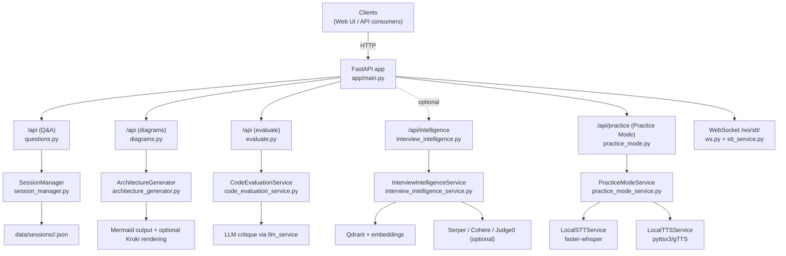
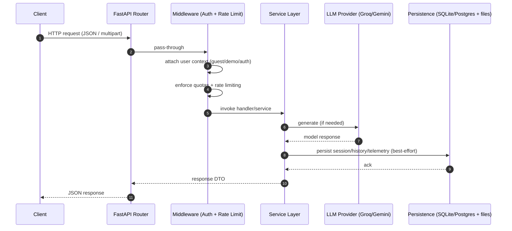
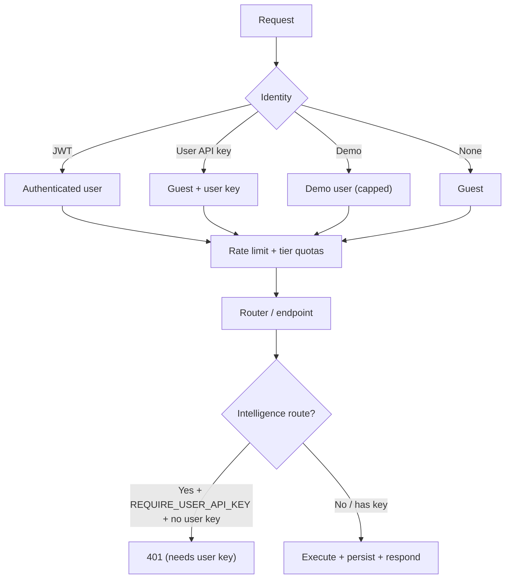

# Stratax AI Backend — Technical Documentation (Code-Derived)

> This document is intentionally **grounded in the repository’s code** (primarily under `app/`) and its runtime artifacts (`Dockerfile`, `docker-compose.yml`, `requirements.txt`). Where behavior is inferred from framework conventions (FastAPI/Pydantic), it is stated explicitly as such.

## Executive Summary (Non-Technical)

### What Stratax AI does (in 5 bullets)

- Provides an AI interview copilot that answers technical and behavioral questions with consistent formatting.
- Runs realistic mock interviews and practice sessions with feedback and scoring.
- Supports system design assistance, including architecture diagrams and multi-view perspectives.
- Adds “interview intelligence” search to find and generate relevant questions (company/topic/difficulty).
- Captures privacy-aware telemetry to turn practice activity into actionable improvement insights.

### Who this backend is for

- Founders and product teams building an interview-prep product (or embedding interview coaching into an existing app).
- Engineering teams that want a production-shaped API (auth, quotas, rate limits, logging, modular subsystems).
- Researchers/ML engineers experimenting with retrieval + evaluation + coaching loops.
- Students and early-career candidates preparing for internships and entry-level roles (via practice sessions, feedback, and curated questions).

### Key differentiators

- Multi-provider LLM orchestration (Groq/Gemini) with a consistent request/response contract.
- Practice Mode that combines local audio processing (STT/TTS) with coaching-style analytics.
- Retrieval pipeline (vector search + optional hybrid/rerank/query expansion) designed for “interview question discovery”.
- Cost controls that support real-world deployment: demo mode, quotas, tier limits, and per-user keys.

### Problems it solves

- Makes interview practice measurable (scores, trends, and recommended focus) instead of purely subjective.
- Reduces the time to prepare for company-specific or domain-specific interview loops.
- Helps teams ship an interview assistant safely by default (auth + rate limiting + structured telemetry).

<div style="page-break-after: always;"></div>

## 1) Project Overview

### Purpose

The backend provides a FastAPI service for an “AI Interview Assistant” with:

- **Q&A sessions** (create session, ask question, persist Q&A)
  - `app/routers/questions.py`, `app/services/session_manager.py`
- **Architecture/diagram generation** (Mermaid + sanitization + optional rendering)
  - `app/routers/diagrams.py`, `app/services/architecture_generator.py`, `app/utils/story_contract.py`
- **Code evaluation** (static signals + LLM critique)
  - `app/routers/evaluate.py`, `app/services/code_evaluation_service.py`
- **Interview Intelligence** (search/generation, vector DB via Qdrant, optional web/rerank/code-exec features)
  - `app/routers/interview_intelligence.py`, `app/services/interview_intelligence_service.py`
- **Mock interview sessions** (question sequences + LLM-based scoring)
  - `app/routers/mock_interview.py`, `app/services/mock_interview_service.py`
- **Practice Mode** (round-based interview practice + local STT/TTS + analytics/evaluation orchestration)
  - `app/routers/practice_mode.py`, `app/services/practice_mode_service.py`, `app/services/local_stt_service.py`, `app/services/local_tts_service.py`
- **Telemetry + learning loops** (structured event stream + deterministic personalization hints)
  - `app/models.py` (`EventRecord`), `app/utils/event_logging.py`, `app/services/learning_loops.py`
- **Authentication + user profiles** (JWT login, optional Google OAuth, user-stored provider keys)
  - `app/routers/auth_routes.py`, `app/auth.py`, `app/models.py` (`User`)
- **Rate limiting + demo-mode cost controls** (tier-based metering for expensive endpoints)
  - `app/middleware/rate_limit.py`, `app/models.py` (`UserTier`, `TIER_QUOTAS`), `app/config.py` (demo key pool flags)
- **Real-time partial transcripts over WebSocket** (STT streaming stub)
  - `app/routers/ws.py`, `app/services/stt_service.py`

### Entry point and lifecycle

The application entrypoint is `app/main.py`.

- FastAPI app is created with a `lifespan` manager that initializes:
  - Database tables via SQLAlchemy (SQLite or Postgres depending on `DATABASE_URL`)
  - In-memory rate limiter cleanup loop
  - Interview Intelligence (if optional deps available; guarded on `qdrant_client` import)
  - Mock interview service
  - History manager
  - Practice Mode service (if enabled)
  - `app/main.py`

- Startup flags affecting initialization:
  - `settings.fast_startup=true` skips heavier initialization (Interview Intelligence and Practice Mode)
  - `settings.disable_interview_intelligence=true` force-disables Interview Intelligence even if deps exist
  - See: `app/config.py`, `app/main.py`

- Health endpoints:
  - `GET /health` (comprehensive health: DB + LLM config + vector DB status)
  - `GET /health/ready` (readiness probe; returns 200 only if DB is reachable)
  - `GET /health/live` (liveness probe; returns 200 if process is running)
  - `GET /health/simple` (small legacy shape: version + LLM provider)
  - `GET /api/identity-check` (diagnostic for “identity guard” behavior)
  - `app/main.py`

## 2) Technology Stack

### Runtime / framework

- **Python** (Docker image uses `python:3.11-slim`) — `Dockerfile`
- **FastAPI** app + routers — `app/main.py`, `app/routers/*`
- **Starlette** responses/middleware (`JSONResponse`, CORS) — `app/main.py`
- **Pydantic / pydantic-settings** for config and schemas — `app/config.py`, `app/schemas.py`

### AI / LLM providers

- **Groq SDK** (`groq.Groq`) — used in `app/services/llm_service.py`
- **Google Generative AI** (`google.generativeai`) — used when available in `app/services/llm_service.py`

Provider choice is driven by `settings.llm_provider` (`app/config.py`), and the LLM service routes accordingly (`app/services/llm_service.py`).

### Agents (Practice Mode)

Practice Mode composes multiple “agent” classes (in `app/services/`) that wrap LLM calls and/or local signal processing:

- `InterviewerAgent` — question bank + question sequencing + micro-feedback; **optionally** uses Gemini directly via `google.generativeai` when available (`GEMINI_AVAILABLE`).
  - `app/services/interviewer_agent.py`
- `SpeechAnalyticsAgent` — delivery metrics extraction using audio DSP; **not** an LLM component.
  - `app/services/speech_analytics_agent.py`
- `AdaptiveInterviewerAgent` — LLM-driven “comprehensive answer evaluation” (JSON-mode) via the shared `llm_service`.
  - `app/services/adaptive_interviewer_agent.py`
- `ConversationalAgent` — LLM-driven profile inference from natural language input via the shared `llm_service`.
  - `app/services/conversational_agent.py`
- `EvaluationAgent` — end-of-interview coaching report generation (expects JSON) via the shared `llm_service`.
  - `app/services/evaluation_agent.py`

### Retrieval / vector DB / search

- **Qdrant local client** for vector storage (`QdrantClient(path=...)`) — `app/services/interview_intelligence_service.py`
- **SentenceTransformers** embeddings (`SentenceTransformer`) — `app/services/interview_intelligence_service.py`
- **LangChain Community** tooling (BM25 retriever, embeddings wrapper, Qdrant vectorstore, splitters) — `app/services/ai_native_enhancements.py`
- **aiohttp** used for HTTP calls (GitHub API, Serper, Cohere, code execution APIs) — `app/services/*`

### AI / ML / DSP libraries (from `requirements.txt`)

This project installs the following AI/ML/DSP-related libraries (not all are used in every code path):

- **torch (CPU build)** — embedding model runtime
- **sentence-transformers**, **sentencepiece**, **huggingface_hub** — embeddings + tokenizer/model downloads
- **qdrant-client** — local vector DB client
- **langchain-community**, **langchain-text-splitters** — BM25 + vectorstore helpers + chunking utilities
- **rank-bm25** — BM25 scoring (also referenced by LangChain BM25 retriever)
- **cohere** — reranking client (used behind the `CohereReranker` abstraction)
- **numpy**, **scipy**, **scikit-learn**, **joblib** — numeric computation and supporting ML utilities
- **librosa**, **soundfile**, **audioread** — local audio feature extraction for speech analytics
- **faster-whisper** — local STT
- **pyttsx3**, **gtts**, **pydub** — TTS + audio handling

### Audio (Practice Mode)

- **faster-whisper** (local STT) — `app/services/local_stt_service.py`
- **pyttsx3** (offline TTS) + **gTTS** fallback — `app/services/local_tts_service.py`

### Containerization

- Docker build/run — `Dockerfile`
- docker-compose with optional **Kroki** container for Mermaid rendering — `docker-compose.yml`

## 3) Architecture Diagram



## 3.1 Request Lifecycle (sequence)



## 3.2 Security Model (high level)



## 4) Module Documentation

### 4.1 `app/main.py` — application composition

- Creates FastAPI app with lifespan startup/shutdown.
- Adds permissive CORS middleware (`allow_origins=["*"]`, `allow_methods=["*"]`, `allow_headers=["*"]`).
- Adds a custom “user auth” middleware that extracts and stores `user_id` on `request.state`.
- Adds tier-based rate limiting middleware for expensive endpoints (Q&A, evaluate, practice, mock-interview, architecture generation).
- Includes routers:
  - `auth_router` at `/auth` (JWT auth + Google OAuth)
  - `history_router` at `/api/history`
  - `questions_router` at `/api`
  - `diagrams_router` at `/api`
  - `evaluate_router` at `/api`
  - `interview_intelligence` (optional) at `/api/intelligence`
  - `ws_router` (WebSocket) no prefix
  - `mock_interview_router` at `/api/mock-interview`
  - `practice_router` (already prefixed `/api/practice`)

### 4.2 `app/config.py` — settings and feature flags

`Settings` is a `BaseSettings` class with defaults and environment-variable overrides.

Notable settings (non-exhaustive; see file for full list):

- Server: `host`, `port`, `cors_allow_origins`
- Environment URLs used for OAuth redirects: `backend_base_url`, `frontend_url`
- App identity: `app_name`, `app_developer_name`, `app_developer_attribution`
- API auth: `api_key` (simple bearer), `cookie_secret`
- JWT auth: `jwt_secret_key`
- Secrets encryption: `secrets_encryption_key`
  - When set (recommended), user-stored provider keys in the `users` table are stored encrypted with an `enc:` prefix (Fernet).
  - Backward compatibility: older plaintext DB rows can still be read.
  - Production behavior: the app requires persistent `JWT_SECRET_KEY` and `COOKIE_SECRET` at startup, and profile updates will refuse to store provider keys unless `STRATAX_SECRETS_ENCRYPTION_KEY` is configured.
- LLM: `llm_provider`, `groq_api_key`, `groq_model`, `gemini_api_key`, `gemini_model`, token/temperature knobs
- Demo mode key pool (cost-capped public demo):
  - `stratax_demo_api_key`, `stratax_demo_api_keys`
  - `enable_demo_key_pool`, `allow_demo_key_pool_in_dev`, `demo_global_daily_request_limit`
- External features: `serper_api_key`, `cohere_api_key`, `judge0_api_key`
- Feature flags: `enable_hybrid_search`, `enable_reranking`, `enable_code_execution`, `enable_query_expansion`, `enable_streaming`
- API key policy: `require_user_api_key`

See also (crypto helper used by auth + demo-mode key resolution): `app/utils/secret_crypto.py`.
- Telemetry (EventRecord stream): `analytics_hmac_key`, `analytics_store_raw_text`, `analytics_text_preview_len`, `enable_event_logging`
- STT (WebSocket): `stt_provider`
- Practice mode toggles + audio config (`practice_mode_enabled`, `practice_*`)
- Architecture detection heuristics (`architecture_detection_*`, `architecture_complexity_signals`)

Provider selection behavior note:

- `settings.get_effective_provider(feature="copilot"|"default")` chooses Gemini for Copilot when both providers exist, and Groq for other features.
- This is separate from per-request “Bridge Settings” keys (headers) which take precedence.

See: `app/config.py`.

See: `app/config.py`.

### 4.3 `app/middleware/auth.py` — “user_id” extraction

`user_auth_middleware` attaches `request.state.user_id` when it can find a user identifier in:

1. A stable guest identifier header: `x-stratax-guest-id` or `x-client-id` (path-safe)
2. A cookie: `stratax_guest_id` (path-safe)
3. A fallback legacy guest id derived from a hash of client IP + user-agent (then persisted as a cookie)
4. `Authorization: Bearer <token>` only when the token *looks like a JWT* (3 dot-separated segments): it is decoded/validated and used to resolve a real `User` from the DB

Note: `Authorization` is also used in some flows for user-provided LLM API keys. Middleware intentionally avoids attempting JWT decode for non-JWT bearer tokens.

See: `app/middleware/auth.py`.

### 4.3.1 `app/auth.py` + `app/routers/auth_routes.py` — JWT auth + user profile

This repository includes a full user auth subsystem backed by SQLite:

- `POST /auth/register` — create user and return JWT
- `POST /auth/login` — return JWT
- `GET /auth/me` — current user profile (requires JWT)
- `PUT /auth/me` — update profile (including optional user-stored Groq/Gemini keys)
- `POST /auth/change-password` — rotate password
- `GET /auth/quota` — tier limits derived from `TIER_QUOTAS`
- `GET /auth/google` and `GET /auth/google/callback` — Google OAuth popup flow (optional)

See: `app/auth.py`, `app/routers/auth_routes.py`, `app/models.py`, `app/database.py`.

### 4.3.2 `app/middleware/rate_limit.py` — tier limits + demo mode

Rate limiting is implemented with an in-memory limiter by default, with an optional Redis-backed limiter for multi-worker/multi-instance deployments:

- Default: `InMemoryRateLimiter` (single-instance)
- If `REDIS_URL` is set: `RedisRateLimiter` (distributed; TTL-based)

- Only meters expensive, LLM-backed routes by allowlist (keeps UX stable)
- Uses `TIER_QUOTAS` for authenticated users (`User.tier`)
- Supports a “demo” mode (unauthenticated + no user-provided API key) with strict session-window caps
- Adds debug headers:
  - `X-Stratax-User-Type`: `demo` | `guest` | `registered`
  - `X-RateLimit-*`: limit/remaining/reset

See: `app/middleware/rate_limit.py`, `app/models.py`.

### 4.4 `app/services/session_manager.py` — Q&A session state + persistence

- `SessionManager` maintains per-user in-memory session cache and persists sessions to disk.
- Storage location: `data/sessions/<user_id>/<session_id>.json`.
- Includes debounce logic to prevent rapid duplicate session creation.

See also (persistence adapter):

### 4.4.1 `app/repositories/*` — persistence adapters

- `ChatSessionRepository` (`app/repositories/chat_sessions.py`) is used by `SessionManager` for file/DB-backed session persistence.
- `HistoryTabRepository` (`app/repositories/history_tabs.py`) is used by `HistoryManager` for the History tab CRUD surface.

See: `app/services/session_manager.py`.

### 4.5 `app/services/llm_service.py` — LLM routing + identity guard

- Holds a large “forward prompt” (`CODE_FORWARD_PROMPT`) with formatting rules and identity/attribution rules.
- Imports Groq SDK and Gemini SDK (Gemini import is optional; guarded).
- Exposes a global `llm_service` instance used by routers/services.

See also (prompt assembly + post-processing):

### 4.5.1 `app/prompts/*` — prompt composition + response planning

- `app/prompts/builder.py` builds the system prompt using policy modules (`policies.py`, `mirror_policies.py`).
- `app/prompts/response_plan.py` defines response-structure constraints used to keep answers consistent.

### 4.5.2 `app/services/llm/*` — response normalization + identity/intent helpers

- `app/services/llm/response_postprocess.py` normalizes bullet formatting and output consistency.
- `app/services/llm/identity.py` implements identity/attribution guard behavior.
- `app/services/llm/intent_overrides.py` implements deterministic intent routing overrides.

See: `app/services/llm_service.py`.

### 4.6 `app/routers/questions.py` — Q&A endpoints

Key endpoints (prefix `/api` via `app/main.py`):

- `POST /api/session` — create a new session (`SessionManager.create_session`)
- `POST /api/question` — main Q&A endpoint; selects user-supplied API keys from headers and can fall back to server keys depending on config
- Additional session/history endpoints exist later in the file (list extracted from decorators):
  - `POST /api/upload_profile`
  - `GET /api/sessions`
  - `DELETE /api/session/{session_id}`
  - `DELETE /api/history/{session_id}`
  - `DELETE /api/history/{session_id}/{index}`
  - `PUT /api/session/{session_id}/title`
  - `GET /api/session/{session_id}/chat`

See: `app/routers/questions.py`.

### 4.7 `app/routers/diagrams.py` + `app/services/architecture_generator.py` — diagram generation

- Exposes endpoints to render Mermaid and generate architecture packages.
- Uses Mermaid sanitization/repair utilities to strip CSS/HTML artifacts (file is large).
- Uses `KROKI_URL` (via `os.getenv`) as a rendering backend when configured.
- At least one endpoint requires `verify_api_key` (simple bearer auth) via FastAPI dependency injection.

See: `app/routers/diagrams.py`, `app/services/architecture_generator.py`, `app/utils/security.py`.

### 4.8 `app/routers/evaluate.py` + `app/services/code_evaluation_service.py`

- `GET /api/evaluate/allowed` — determines whether evaluation is allowed using a classifier (prefers LLM-based classification when available).
- `POST /api/evaluate` — runs static analysis and an LLM critique; caches results in-memory by a hash over session + context + code.

See: `app/routers/evaluate.py`, `app/services/code_evaluation_service.py`.

### 4.8.1 `app/routers/code_execution.py` — sandboxed code execution (LeetCode-style)

This repo provides a dedicated backend endpoint for code execution:

- `POST /api/code/execute`

Key properties:

- Execution happens server-side via sandbox providers (Judge0 via RapidAPI, with Piston fallback depending on configuration).
- Sandbox credentials (e.g. `JUDGE0_API_KEY`) remain backend-only and must never be exposed to clients.
- HTTP 200 means “request processed”; logical success is represented by the JSON field `success`.

Request shape (see `CodeExecutionIn` in `app/schemas.py`):

- `language` (e.g. `python`, `javascript`, `cpp`)
- `code` (source)
- `stdin` (optional)
- `test_cases` (optional list)
- `trace` (optional, enables step/line trace when supported)
- `trace_max_events` (optional cap)
- `explain_trace` (optional, attaches human-readable per-line explanations when tracing)

Response shape (see `CodeExecutionOut` in `app/schemas.py`):

- `success` boolean
- `stdout`, `stderr`
- `status`, `exit_code` (when available)
- `execution_time_seconds`, `memory_kb` (when available)
- Optional: `trace_events[]` (Python real tracing; other languages best-effort timeline)

Tracing & explainability:

- Python tracing uses `sys.settrace` and is filtered to user code frames.
- Per-line explanations use deterministic analysis for Python where possible.

See: `app/routers/code_execution.py`, `app/services/chat/ai_native_enhancements.py`, `app/utils/code_line_explain.py`.

Rate limiting:

- `/api/code/execute` is protected by demo-mode quotas and the global rate limiting/metering middleware.
- See: `app/middleware/rate_limit.py`.

### 4.9 `app/routers/interview_intelligence.py` + `app/services/interview_intelligence_service.py`

Interview Intelligence is **optional at startup** (disabled if `qdrant_client` is missing). When enabled:

- Uses a Qdrant local store under `data/interview_intelligence_v2/vector_db`.
- Uses SentenceTransformers embeddings (and caches/loads a local model under `data/models/all-MiniLM-L6-v2`).
- Supports LLM-based question generation with JSON parsing/repair and optional “backfill” of code solutions.
- Enforces API key policy:
  - When `REQUIRE_USER_API_KEY=true`, Interview Intelligence search endpoints return **401** unless the client provides a key via `X-API-Key`, `X-Gemini-Key`, or `Authorization: Bearer <key>`.
- History behavior (important for UI correctness):
  - Standard search (`GET/POST /api/intelligence/search`) accepts `save_to_history`, but the backend intentionally **does not auto-save** standard search results to History to avoid duplicates.
  - The frontend should save exactly once via `POST /api/history/`.
- References optional features toggled by settings:
  - Hybrid search (`HybridSearchEngine`)
  - Reranking (`CohereReranker`)
  - Code execution (`CodeExecutionSandbox`)
  - Streaming updates (`RealTimeSearchStream`)
  - Query expansion (`QueryExpansion`)

See: `app/main.py`, `app/routers/interview_intelligence.py`, `app/services/interview_intelligence_service.py`, `app/services/ai_native_enhancements.py`.

### 4.10 `app/routers/mock_interview.py` + `app/services/mock_interview_service.py`

- Implements a mock interview workflow with sessions persisted to `data/sessions/mock_interview_sessions.json`.
- Uses `llm_service.generate_answer(...)` to generate evaluations and hints.
- Endpoints are under `/api/mock-interview`.

See: `app/routers/mock_interview.py`, `app/services/mock_interview_service.py`.

### 4.11 Practice Mode: `app/routers/practice_mode.py` + `app/services/practice_mode_service.py`

- Router is mounted at `/api/practice` (router itself sets `prefix="/api/practice"`).
- Service orchestrates multiple agents, local STT/TTS, and evaluation.
- Optional “proctoring” is supported via a privacy-safe event-only endpoint:
  - `POST /api/practice/proctoring/event`
  - Client initiates camera access; the backend only logs signals (no frames/audio by default)
  - Events are validated against an active practice `session_id` and logged into `EventRecord` as `practice_proctoring_*`
- Concrete agent components (constructed inside `PracticeModeService`) include:
  - `InterviewerAgent` (`app/services/interviewer_agent.py`)
  - `AdaptiveInterviewerAgent` (`app/services/adaptive_interviewer_agent.py`)
  - `ConversationalAgent` (`app/services/conversational_agent.py`)
  - `EvaluationAgent` (`app/services/evaluation_agent.py`)
  - Speech delivery metrics are computed via `SpeechAnalyticsAgent` (`app/services/speech_analytics_agent.py`).
- Supports round-based interviews via `RoundConfigService` and `InterviewRound`.
- Stores synthesized audio under `data/practice_audio` by default.

See: `app/routers/practice_mode.py`, `app/services/practice_mode_service.py`, `app/services/local_stt_service.py`, `app/services/local_tts_service.py`, `app/config_practice_mode.py`.

### 4.12 WebSocket STT: `app/routers/ws.py` + `app/services/stt_service.py`

- WebSocket endpoint: `GET ws://.../ws/stt/{session_id}`.
- Requires API key only if `settings.api_key` is set, provided via `Sec-WebSocket-Protocol` header.
- The `STTService` in `app/services/stt_service.py` is currently a stub: if enabled, it yields `"..."` per chunk; if disabled, it yields `"(audio)"` per chunk.

See: `app/routers/ws.py`, `app/utils/security.py`, `app/services/stt_service.py`.

### 4.13 Telemetry & learning loops: `EventRecord` + `event_logging` + `learning_loops`

This repo includes a lightweight “data moat” foundation based on a structured event stream.

- Events are stored in the SQL database table `event_records` (`EventRecord` in `app/models.py`).
- `app/utils/event_logging.py` provides:
  - stable IDs for questions (`stable_question_id`) using SHA256 or **HMAC-SHA256** (when `analytics_hmac_key` is set)
  - safe-by-default storage (raw text is not stored unless explicitly enabled)
  - best-effort writes (event logging never blocks product flows)
- `app/services/learning_loops.py` aggregates recent events into explainable, deterministic signals.
- Practice Mode consumes these signals:
  - `GET /api/practice/insights` returns aggregated insights and a recommended focus list.
  - Practice start flows may merge those recommended focus areas into `UserProfile.interview_focus`.

See: `app/models.py`, `app/utils/event_logging.py`, `app/services/learning_loops.py`, `app/routers/practice_mode.py`.

## 5) Data Flow (request → response)

### 5.1 Q&A flow (`POST /api/question`)

1. Client sends question payload (`QuestionIn`) to `POST /api/question`.
2. Router selects an API key (prefers `X-Gemini-Key`, else `X-API-Key`, else `Authorization`).
3. Router determines `user_id` from `request.state.user_id` (middleware) and uses `SessionManager` for that user.
4. Router calls `llm_service` to generate an answer and updates the session with Q&A.
5. Response is returned (and may be streamed depending on implementation; the router imports `StreamingResponse`).

Evidence: `app/routers/questions.py`, `app/services/session_manager.py`, `app/middleware/auth.py`, `app/services/llm_service.py`.

### 5.2 Code evaluation flow (`POST /api/evaluate`)

1. Client sends `EvaluationIn` including code + optional problem statement.
2. Router extracts API keys similarly to Q&A.
3. Router loads session context from `SessionManager` and decides if evaluation is allowed.
4. `evaluate_code(...)` runs static analysis and asks the LLM for critique.
5. Result is cached in-memory keyed by session + conversation context + code.

Evidence: `app/routers/evaluate.py`, `app/services/code_evaluation_service.py`, `app/services/session_manager.py`.

### 5.3 Practice Mode flow (audio upload)

1. Client starts an interview (`/api/practice/interview/start` or `/start-round`).
2. Client uploads an audio answer (`/api/practice/interview/submit-answer`).
3. Server writes the uploaded file, transcribes with `LocalSTTService` (faster-whisper).
4. Speech delivery metrics are computed (via `SpeechAnalyticsAgent`) and micro-feedback is generated.
5. Depending on route/phase, additional LLM-based evaluation can occur:
  - Per-answer comprehensive evaluation (via `AdaptiveInterviewerAgent.evaluate_answer_comprehensively`, JSON-mode)
  - End-of-interview coaching report (via `EvaluationAgent.evaluate_interview`, JSON-mode)
5. Next question is gated behind an “acknowledge feedback” endpoint.

Evidence: `app/routers/practice_mode.py`, `app/services/practice_mode_service.py`, `app/services/local_stt_service.py`.

### 5.3.1 Practice Mode proctoring signals (event-only)

The backend cannot enable the camera. Proctoring is client-driven and opt-in:

1. Client starts a practice session (`POST /api/practice/interview/start`).
2. Client acquires camera permissions locally (`getUserMedia`) and begins monitoring signals.
3. Client posts privacy-safe events to `POST /api/practice/proctoring/event`.
4. Server validates the `session_id` exists, then logs an `EventRecord` with:
   - `event_type`: `practice_proctoring_{event_type}` (example: `practice_proctoring_tab_switch`)
   - `extra_data`: `severity`, `metadata`, and optional `client_timestamp`

Example request payload:

```json
{
  "session_id": "<practice_session_id>",
  "event_type": "tab_switch",
  "severity": "violation",
  "metadata": {"reason": "visibilitychange", "hidden": true},
  "client_timestamp": "2026-01-26T12:34:56Z"
}
```

### 5.4 Interview Intelligence search flow

At a high level (file is large):

- Query intent is analyzed (rule-based parsing).
- Questions may be generated by the LLM.
- Optional web search via Serper, reranking via Cohere, code execution via Judge0/Piston may be used when enabled/configured.
- Results can be persisted to local vector DB.

Evidence: `app/services/interview_intelligence_service.py`, `app/services/ai_native_enhancements.py`.

## 5.5 “AI-native enhancements” pipeline (Interview Intelligence)

When enabled via settings flags, Interview Intelligence can compose the following optional pipeline stages:

- **Query expansion** (`QueryExpansion`) — uses `llm_service` to expand/augment a user query.
- **Hybrid retrieval** (`HybridSearchEngine`) — combines lexical BM25-style retrieval with semantic retrieval (Qdrant + embeddings).
- **Reranking** (`CohereReranker`) — reorders candidates using the Cohere API.
- **Code execution** (`CodeExecutionSandbox`) — executes code through external sandboxes (Judge0 and/or Piston).
- **Streaming updates** (`RealTimeSearchStream`) — provides a streaming search result pattern (referenced in router/service).

Evidence: `app/services/ai_native_enhancements.py`, `app/services/interview_intelligence_service.py`.

## 6) Configuration & Environment

### Settings loading

- Env files are loaded eagerly via `python-dotenv`, supporting layered configs through `ENV_FILE` (comma-separated), e.g. `ENV_FILE=.env,.env.local`.
- `SettingsConfigDict.env_file` is also set to those same env files (Pydantic loads them as part of settings resolution).
- `Settings` fields can be overridden via environment variables (Pydantic convention: field name, typically uppercased, e.g. `GROQ_API_KEY`).

See: `app/config.py`.

### Key environment variables (from `Settings`)

- `API_KEY` — protects certain endpoints via `verify_api_key` / `websocket_verify_api_key` when set (`app/utils/security.py`).
- `LLM_PROVIDER` — `groq` or `gemini` (`app/config.py`).
- `GROQ_API_KEY`, `GROQ_MODEL`, `GROQ_STREAM`, token/temperature settings.
- `GEMINI_API_KEY`, `GEMINI_MODEL`.
- `SERPER_API_KEY`, `COHERE_API_KEY`, `JUDGE0_API_KEY`.
- Feature flags: `ENABLE_HYBRID_SEARCH`, `ENABLE_RERANKING`, `ENABLE_CODE_EXECUTION`, `ENABLE_QUERY_EXPANSION`, `ENABLE_STREAMING`.
- `REQUIRE_USER_API_KEY` — when true, user requests must include their own key (enforced in Interview Intelligence service codepaths).
- Telemetry / event logging:
  - `ANALYTICS_HMAC_KEY` — enables HMAC-SHA256 stable IDs for event logging
  - `ANALYTICS_STORE_RAW_TEXT` — if true, event payloads may include text previews (default false)
  - `ANALYTICS_TEXT_PREVIEW_LEN` — preview length when storing text previews (default 120)
  - `ENABLE_EVENT_LOGGING` — enable/disable structured event logging (default true)
- Practice Mode: `PRACTICE_MODE_ENABLED`, `PRACTICE_AUDIO_STORAGE`, `PRACTICE_STT_MODEL_SIZE`, etc.
- `STT_PROVIDER` — affects WebSocket STT stub behavior.

### Additional environment variables read directly

- `KROKI_URL` — used by `app/routers/diagrams.py` (via `os.getenv`).
- `GITHUB_TOKEN` / `GITHUB_API_KEY` — used by GitHub search logic in `app/services/dynamic_interview_sources.py`.

### Demo mode key pool

This backend can optionally power a cost-capped public demo:

- If a user is unauthenticated and provides no `X-API-Key`/`X-Gemini-Key`, the request can be treated as `demo`.
- When enabled (`ENABLE_DEMO_KEY_POOL=true`), the backend can route those demo requests through a Stratax-controlled Groq key pool (`STRATAX_DEMO_API_KEYS`).
- In development, demo key pool is **disabled by default** unless `ALLOW_DEMO_KEY_POOL_IN_DEV=true` (safety feature).

See: `app/config.py`, `app/middleware/rate_limit.py`.

## 7) Build & Deployment

### Docker

- Container runs: `uvicorn app.main:app --host 0.0.0.0 --port 7860 --workers 1`.
- Healthcheck hits: `http://localhost:7860/health`.

See: `Dockerfile`.

### docker-compose

- Exposes port `7860:7860`.
- Sets `KROKI_URL=http://kroki:8000/mermaid/svg` and starts a `yuzutech/kroki` container.
- Starts supporting infra services for production-like behavior:
  - Postgres (when `DATABASE_URL` points to it)
  - Qdrant as a service (avoids local file-lock issues; enables multi-worker)
  - Redis (distributed rate limiting + shared caches)
- Mounts `./app` into the container and several `./data/*` directories.

See: `docker-compose.yml`.

## 8) Security & Best Practices (as implemented)

### Application-level auth (API key)

- `verify_api_key` enforces `Authorization: Bearer <API_KEY>` only when `settings.api_key` is set.
- `websocket_verify_api_key` enforces API key via `Sec-WebSocket-Protocol` header (when `settings.api_key` is set).

See: `app/utils/security.py`, `app/routers/ws.py`.

### User authentication (JWT)

- User accounts are stored in the configured SQL DB (`DATABASE_URL`; SQLite or Postgres).
- JWT bearer auth is used for `/auth/*` protected routes (FastAPI `HTTPBearer`).
- Google OAuth is supported when `GOOGLE_CLIENT_ID` and `GOOGLE_CLIENT_SECRET` are configured.

See: `app/auth.py`, `app/routers/auth_routes.py`, `app/database.py`, `app/models.py`.

### Per-user isolation

- Session files are stored under `data/sessions/<user_id>/...`.
- The `user_id` is derived from headers/auth/query/cookie and stored in `request.state`.

See: `app/services/session_manager.py`, `app/middleware/auth.py`.

### CORS

CORS is currently configured as fully permissive (allow all origins, methods, headers).

See: `app/main.py`.

### Audit logging

`auditor.configure(settings.analytics_path)` sets up JSONL audit logging when enabled.

See: `app/main.py`, `app/utils/audit.py`.

## 9) Known Issues & Recommendations (code-based)

### Forward-looking hardening checklist

- **JWT hardening (header separation + consistency)**: keep JWT auth in `Authorization` and move user-provided LLM keys to a dedicated header (to avoid ambiguity); ensure all request identity flows consistently use the JWT `sub` as the canonical `user_id`.
- **Redis rate limiting (distributed quotas)**: enable the existing Redis limiter by setting `REDIS_URL` so quotas survive restarts and scale across workers/instances.
- **Multi-worker scaling**: move file-backed session/history storage to a shared DB/object store and run Qdrant as a separate service (or managed Qdrant) to avoid local file locks.
- **Production STT**: replace the WebSocket STT stub with a real streaming STT provider (or a faster-whisper streaming adapter) with backpressure + input validation.

1. **WebSocket STT is currently a stub**
   - `STTService.stream_transcribe` yields placeholder tokens rather than real transcripts.
   - Evidence: `app/services/stt_service.py`.

2. **Authorization header dual-use can be confusing**
  - The API supports both JWT auth and user-supplied LLM keys; some client flows use `Authorization: Bearer ...` for keys.
  - Middleware only attempts JWT decode when the token looks like a JWT (dot-separated); otherwise the request proceeds as guest.
  - Recommendation: separate JWT auth from user-key auth via distinct headers.
  - Evidence: `app/middleware/auth.py`, `app/utils/demo_mode.py`.

3. **Local Qdrant file-lock conflicts are anticipated**
   - Interview Intelligence initialization includes explicit handling for “already accessed by another instance”.
   - Lifespan startup attempts to share a single vector client across services to avoid lock conflicts.
   - Evidence: `app/main.py`, `app/services/interview_intelligence_service.py`.

4. **Mixed persistence models**
   - Sessions: per-session JSON files per user.
   - Mock interview: one JSON file containing many sessions.
   - History: JSONL-style storage (via HistoryManager).
   - Recommendation: document backup/rotation strategy and consider a unified persistence layer if multi-worker scaling is required.
   - Evidence: `app/services/session_manager.py`, `app/services/mock_interview_service.py`, `app/services/history_manager.py`.

6. **Interview Intelligence history duplicates (avoid double-save)**
  - Symptom: one search appearing twice in History.
  - Cause: backend auto-save + frontend save both writing entries.
  - Current behavior: backend standard search path skips auto-save; frontend should be the single source of truth (`POST /api/history/`).
  - Evidence: `app/routers/interview_intelligence.py` (`_search_and_build_response`).

7. **Rate limiting defaults to in-memory unless Redis is configured**
  - Good for single-instance deployments; not shared across workers/instances.
  - Recommendation: set `REDIS_URL` to enable the built-in `RedisRateLimiter` for distributed rate limiting.
  - Evidence: `app/middleware/rate_limit.py`, `app/config.py`.

## 10) Complete API Reference

### Authentication (`/auth`)

| Method | Endpoint | Description |
|--------|----------|-------------|
| POST | `/auth/register` | Register and receive JWT |
| POST | `/auth/login` | Login and receive JWT |
| GET | `/auth/me` | Get current user profile (JWT required) |
| PUT | `/auth/me` | Update profile (JWT required) |
| POST | `/auth/change-password` | Change password (JWT required) |
| GET | `/auth/quota` | Get tier quotas (JWT required) |
| GET | `/auth/google` | Start Google OAuth flow (optional) |
| GET | `/auth/google/callback` | OAuth callback (redirects to frontend) |

### Core Q&A Endpoints (`/api`)

| Method | Endpoint | Description | Auth Required |
|--------|----------|-------------|---------------|
| POST | `/api/session` | Create new Q&A session | No |
| POST | `/api/question` | Submit question and get AI answer | Optional |
| POST | `/api/mirror/feedback` | Return “mirror mode” feedback report | No |
| POST | `/api/upload_profile` | Upload resume/JD for context | No |
| GET | `/api/sessions` | List all user sessions | No |
| DELETE | `/api/session/{session_id}` | Delete specific session | No |
| DELETE | `/api/history/{session_id}` | Clear session history | No |
| DELETE | `/api/history/{session_id}/{index}` | Delete specific Q&A | No |
| PUT | `/api/session/{session_id}/title` | Update session title | No |
| GET | `/api/session/{session_id}/chat` | Get session chat history | No |

### Code Evaluation (`/api/evaluate`)

| Method | Endpoint | Description |
|--------|----------|-------------|
| GET | `/api/evaluate/allowed` | Check if evaluation allowed for context |
| POST | `/api/evaluate` | Evaluate code with static + LLM analysis |

### Diagrams & Architecture (`/api`)

| Method | Endpoint | Description | Auth Required |
|--------|----------|-------------|---------------|
| POST | `/api/render_mermaid` | Render Mermaid diagram to SVG | Yes |
| GET | `/api/render_mermaid` | Render via GET with query params | No |
| POST | `/api/generate_architecture` | Generate architecture diagrams from code | No |
| GET | `/api/architecture/available_views` | List available diagram views | No |
| POST | `/api/architecture/recommend_views` | Get recommended views for codebase | No |
| POST | `/api/architecture/export_markdown` | Export architecture as Markdown | No |

### Practice Mode (`/api/practice`)

| Method | Endpoint | Description |
|--------|----------|-------------|
| GET | `/api/practice/rounds/available` | List available interview rounds |
| POST | `/api/practice/interview/start-round` | Start round-based interview |
| GET | `/api/practice/difficulty-preview` | Preview difficulty levels |
| POST | `/api/practice/interview/quick-start` | Quick conversational start |
| POST | `/api/practice/interview/start` | Start full practice interview |
| POST | `/api/practice/proctoring/event` | Ingest privacy-safe proctoring signals (events only; no media) |
| POST | `/api/practice/interview/submit-answer` | Submit audio answer |
| POST | `/api/practice/interview/acknowledge-feedback` | Acknowledge and get next question |
| POST | `/api/practice/interview/rate-feedback` | Rate feedback quality (signal for coaching loop) |
| GET | `/api/practice/insights` | Get explainable practice insights + recommended focus areas |
| GET | `/api/practice/progress/summary` | Get progress summary |
| GET | `/api/practice/progress/heatmap` | Get progress heatmap |
| GET | `/api/practice/progress/next-session` | Get recommended next session plan |
| GET | `/api/practice/conversational-response` | Get conversational AI response |
| GET | `/api/practice/audio/{filename}` | Retrieve synthesized TTS audio |
| GET | `/api/practice/session/{session_id}` | Get practice session details |
| DELETE | `/api/practice/session/{session_id}` | Delete practice session |
| GET | `/api/practice/status` | Get service status |
| GET | `/api/practice/session/{session_id}/evaluation` | Get final evaluation report |
| GET | `/api/practice/session/{session_id}/score` | Get normalized session score summary |
| POST | `/api/practice/cleanup` | Cleanup old audio files |

### Mock Interview (`/api/mock-interview`)

| Method | Endpoint | Description |
|--------|----------|-------------|
| POST | `/api/mock-interview/sessions/start` | Start mock interview session |
| POST | `/api/mock-interview/sessions/submit-answer` | Submit answer to question |
| GET | `/api/mock-interview/sessions/{session_id}` | Get session details |
| GET | `/api/mock-interview/sessions/{session_id}/summary` | Get session summary |
| POST | `/api/mock-interview/sessions/{session_id}/end` | End session |
| DELETE | `/api/mock-interview/sessions/{session_id}` | Delete active session |
| DELETE | `/api/mock-interview/history/{user_id}/sessions/{session_id}` | Delete from history |
| DELETE | `/api/mock-interview/history/{user_id}` | Clear all history |
| GET | `/api/mock-interview/health` | Health check |
| POST | `/api/mock-interview/sessions/{session_id}/hint` | Request hint |
| GET | `/api/mock-interview/sessions/{session_id}/progress` | Get progress |
| GET | `/api/mock-interview/history/{user_id}` | Get user history |

### Interview Intelligence (`/api/intelligence`)

| Method | Endpoint | Description |
|--------|----------|-------------|
| GET | `/api/intelligence/topics` | List available topics |
| GET | `/api/intelligence/questions/{topic}` | Get questions by topic |
| GET | `/api/intelligence/search` | Search questions (GET) |
| POST | `/api/intelligence/search` | Search questions (POST) |
| POST | `/api/intelligence/curate` | Curate questions to local DB |
| GET | `/api/intelligence/search/enhanced` | Enhanced search with AI features |
| POST | `/api/intelligence/search/enhanced` | Enhanced search (POST) |
| GET | `/api/intelligence/sources/stats` | Get source statistics |
| GET | `/api/intelligence/companies` | List companies |
| POST | `/api/intelligence/community/submit` | Submit community question |
| GET | `/api/intelligence/transparency` | Get transparency info |
| GET | `/api/intelligence/health/enhanced` | Enhanced health check |
| POST | `/api/intelligence/update` | Update question database |
| GET | `/api/intelligence/stats` | Get statistics |
| GET | `/api/intelligence/health` | Basic health check |
| GET | `/api/intelligence/search/ultra-production` | Production-grade search |
| POST | `/api/intelligence/code/execute` | Execute code in sandbox |
| POST | `/api/intelligence/questions/{question_id}/vote` | Vote on question |
| GET | `/api/intelligence/features` | List enabled features |
| WebSocket | `/api/intelligence/ws/search` | Streaming search results |

### History (`/api/history`)

| Method | Endpoint | Description |
|--------|----------|-------------|
| GET | `/api/history/` | List all history tabs |
| GET | `/api/history/{tab_id}` | Get specific tab |
| POST | `/api/history/` | Create new tab |
| PUT | `/api/history/{tab_id}` | Update tab |
| DELETE | `/api/history/{tab_id}` | Delete tab |
| DELETE | `/api/history/` | Clear all history |
| GET | `/api/history/search/query` | Search history |
| GET | `/api/history/stats/overview` | Get statistics |
| GET | `/api/history/export/{format}` | Export history |
| GET | `/api/history/debug/raw` | Debug raw data |

### WebSocket Endpoints

| Endpoint | Description | Auth |
|----------|-------------|------|
| `ws://.../ws/stt/{session_id}` | Streaming speech-to-text | Via `Sec-WebSocket-Protocol` |
| `ws://.../api/intelligence/ws/search` | Streaming search results | Optional |

### Health & Diagnostics

| Method | Endpoint | Description |
|--------|----------|-------------|
| GET | `/health` | Main health check (returns version + LLM provider + enabled flag) |
| GET | `/api/identity-check` | Identity guard diagnostic |

## 11) Data Models & Schemas

### Core Data Structures

All request/response schemas are defined in `app/schemas.py`. Key models include:

- **Session Management**: `CreateSessionResponse`, `SessionList`, `SessionHistory`
- **Q&A**: `QuestionIn`, `QuestionOut`, `AnswerStyle` (enum: SHORT, DETAILED)
- **Practice Mode**: `UserProfile`, `PracticeInterviewQuestion`, `SpeechMetrics`, `MicroFeedback`, `EvaluationReport`, `InterviewRound`
- **Mock Interview**: `StartSessionResponse`, `SubmitAnswerResponse`
- **Code Evaluation**: `EvaluationIn`, `EvaluationOut`
- **Diagrams**: `ArchitecturePackageOut`

### Persistence Layer

**File-based storage locations**:

- User sessions: `data/sessions/{user_id}/{session_id}.json`
- Mock interview sessions: `data/sessions/mock_interview_sessions.json`
- Practice audio: `data/practice_audio/` (WAV files)
- History: JSONL format via `HistoryManager`
- Interview Intelligence vector DB: `data/interview_intelligence_v2/vector_db/` (Qdrant local)
- Downloaded models: `data/models/` (sentence-transformers cache)
- Audit logs: Configured via `settings.analytics_path` (JSONL)

## 12) Testing & Quality Assurance

### Test Files in Repository

The repository contains extensive test scripts:

- `test_acknowledge_feedback.py` — Practice mode feedback acknowledgment flow
- `test_alias_validation.py` — Configuration alias validation
- `test_architecture_dynamic_limits.py` — Architecture generation limits
- `test_company_specific.py` — Company-specific interview generation
- `test_difficulty_levels.py` — Question difficulty classification
- `test_evaluation.py` — Code evaluation pipeline
- `test_github_direct.py` — GitHub API integration
- `test_llm_services.py` — LLM service provider switching
- `test_mermaid_fix.py` — Mermaid sanitization/repair
- `test_multiview_detection.py` — Architecture view detection
- `test_practice_mode.py` — Practice mode orchestration
- `test_question_count.py` — Question count configuration
- `test_round_based_422.py` — Round-based interview edge cases
- `test_round_company_tts.py` — Round + company + TTS integration
- `test_session_debounce.py` — Session creation debounce logic
- `test_story_contract.py` — Story/contract validation
- `test_tts_formatting.py` — TTS text normalization
- `test_web_search_debug.py`, `test_web_search.py` — Web search integration

### Running Tests

```bash
# Activate environment
source .venv/bin/activate  # or .venv\Scripts\Activate.ps1 on Windows

# Run specific test
python test_llm_services.py

# Run with pytest (if configured)
pytest tests/ -v
```

### Test Coverage Areas

- ✅ LLM provider switching (Groq ↔ Gemini)
- ✅ Practice mode end-to-end flows
- ✅ Session management and debounce protection
- ✅ Mermaid diagram sanitization
- ✅ Company-specific question generation
- ✅ Architecture detection and view recommendation
- ✅ TTS text normalization for speech synthesis

## 13) Performance & Scalability

### Current Limitations

1. **Single-worker architecture**
   - Dockerfile runs: `--workers 1`
   - Qdrant local file lock prevents multi-process scaling
   - Mitigation: Shared Qdrant client in lifespan startup

2. **In-memory caching**
   - Code evaluation cache: per-process memory only
   - Session manager: per-user in-memory cache
   - Not shared across workers/instances

3. **File-based persistence**
  - Mixed persistence: SQLite database for users/usage/telemetry (and optionally Postgres via `DATABASE_URL`), plus JSON/JSONL files for sessions/history
  - Concurrent write protection via file locks where file-based persistence is used (session manager)
  - Backup/rotation strategy is not fully documented for file-based artifacts

### Optimization Opportunities

- **Async I/O**: FastAPI endpoints are async-capable; LLM calls use `asyncio.to_thread` where needed
- **Embedding model caching**: SentenceTransformer model loaded once at startup
- **Audio processing**: faster-whisper uses CPU inference with configurable model size
- **Vector search**: Qdrant provides efficient HNSW indexing

### Resource Requirements

- **Memory**: ~2-4GB for embedding models + Qdrant indices
- **Disk**: Growing with user sessions, audio files, vector DB
- **CPU**: Embedding inference, audio processing (librosa/faster-whisper)

## 14) Troubleshooting Guide

### Common Issues

#### 1. Qdrant Lock Error

**Symptom**: `qdrant_client.qdrant_client.QdrantException: Database is locked`

**Cause**: Multiple processes trying to access the same Qdrant local storage.

**Solution**:
- Ensure only one server instance is running
- Check for stale processes: `ps aux | grep uvicorn` (Linux) or `Get-Process | Where-Object {$_.ProcessName -like "*python*"}` (Windows)
- Kill stale processes and restart

#### 2. Port Already in Use

**Symptom**: `OSError: [Errno 48] Address already in use`

**Solution**:
```bash
# Find process using port 7860
lsof -ti:7860 | xargs kill -9  # Linux/Mac
netstat -ano | findstr :7860  # Windows (then taskkill /PID <pid> /F)
```

#### 3. Missing API Keys

**Symptom**: LLM calls fail or return mock responses

**Check**:
```bash
# Verify .env file
cat .env | grep -E '(GROQ|GEMINI)_API_KEY'

# Check settings loaded
curl http://localhost:7860/health
```

#### 4. Practice Mode Audio Issues

**Symptom**: Transcription fails or returns empty

**Diagnostics**:
- Check faster-whisper model download: `data/models/`
- Verify audio file format (WAV, 16kHz recommended)
- Check logs for VAD (Voice Activity Detection) output

#### 5. Docker Healthcheck Failing

**Symptom**: Container shows "unhealthy" status

**Known Issue**: `docker-compose.yml` healthcheck targets port **8000**, but app runs on **7860**

**Fix**: Edit `docker-compose.yml`:
```yaml
healthcheck:
  test: ["CMD", "curl", "-f", "http://localhost:7860/health"]
```

### Debug Mode

Enable detailed logging:
```bash
# Set log level
export LOG_LEVEL=DEBUG  # or add to .env
uvicorn app.main:app --log-level debug
```

### Health Check Interpretation

**GET /health** returns (shape is intentionally small):

```json
{
  "status": "ok",
  "version": "0.1.0",
  "llm": {"provider": "gemini", "enabled": true}
}
```

For subsystem readiness, prefer the subsystem health endpoints:

- Interview Intelligence: `GET /api/intelligence/health` (only mounted when enabled)
- Mock Interview: `GET /api/mock-interview/health`

If Interview Intelligence is not available, common causes are missing optional deps (e.g., `qdrant-client`) or Qdrant file-lock conflicts.

## 15) Development Workflow

### Local Development Setup

```bash
# Clone and setup
cd <your-repo-folder>
python -m venv .venv
source .venv/bin/activate  # Windows: .venv\Scripts\Activate.ps1
pip install -r requirements.txt

# Configure environment
cp .env.example .env  # Create from example if available
# Edit .env with your API keys

# Run with hot reload
uvicorn app.main:app --reload --host 0.0.0.0 --port 7860
```

### Continuous Integration (GitHub Actions)

The repo includes a GitHub Actions workflow that runs the unit test suite on push/PR:

- Workflow: `.github/workflows/ci.yml`
- Python: 3.11 + 3.12 matrix
- Tests: `pytest` with coverage (`pytest --cov=app ...`)
- Lint: `ruff check` + `ruff format --check` (non-blocking)
- Security: `safety` + `bandit` (non-blocking)

To keep CI fast and deterministic, CI sets conservative environment flags:

- `APP_ENV=test`
- `FAST_STARTUP=true` and `DISABLE_INTERVIEW_INTELLIGENCE=true` (skips heavier optional subsystems)
- `ENABLE_CODE_EXECUTION=false` (prevents external sandbox calls)
- `JWT_SECRET_KEY` / `COOKIE_SECRET` are set to fixed test values

### Code Organization Best Practices

- **Routers** (`app/routers/`) — HTTP endpoints only; delegate to services
- **Services** (`app/services/`) — Business logic, LLM orchestration, persistence
- **Schemas** (`app/schemas.py`) — Pydantic models for request/response validation
- **Config** (`app/config.py`) — All settings centralized here
- **Utils** (`app/utils/`) — Reusable helpers (security, audit, story contract, etc.)

### Adding a New Endpoint

1. Define request/response schemas in `app/schemas.py`
2. Add route in appropriate router (or create new router)
3. Implement service logic in `app/services/`
4. Register router in `app/main.py` if new
5. Add tests in root directory (`test_<feature>.py`)

### Environment Variables Priority

1. System environment variables (highest priority)
2. `.env` file (loaded via `python-dotenv`)
3. `Settings` class defaults (lowest priority)

See: `app/config.py` for full list of configurable settings.

## 16) Onboarding Guide

### Prerequisites

- Python 3.12+ (Docker image uses `python:3.12-slim`)
- 4GB+ RAM (for embedding models)
- Docker + Docker Compose (for containerized deployment)
- API keys: Groq and/or Gemini (for LLM features)

### Quick Start (5 minutes)

1. **Clone & Install**
   ```bash
  cd <your-repo-folder>
   python -m venv .venv
   source .venv/bin/activate
   pip install -r requirements.txt
   ```

2. **Configure**
   ```bash
   # Minimal .env
   echo "GROQ_API_KEY=your_key_here" > .env
   echo "LLM_PROVIDER=groq" >> .env
   ```

3. **Run**
   ```bash
   uvicorn app.main:app --host 0.0.0.0 --port 7860
   ```

4. **Verify**
   ```bash
   curl http://localhost:7860/health
   ```

### Recommended Learning Path

**Day 1: Core Architecture**
1. Read `app/main.py` — understand router composition and lifespan
2. Review `app/config.py` — see all feature flags and settings
3. Skim `app/schemas.py` — understand request/response contracts

**Day 2: Key Features**
1. Explore `app/routers/questions.py` — core Q&A flow
2. Explore `app/routers/practice_mode.py` — practice interview orchestration
3. Review `app/services/llm_service.py` — LLM provider abstraction

**Day 3: Advanced Components**
1. Study `app/services/interview_intelligence_service.py` — vector search + generation
2. Study `app/services/practice_mode_service.py` — agent composition
3. Review `app/services/ai_native_enhancements.py` — hybrid search, reranking, code execution

**Day 4: Testing & Deployment**
1. Run test suite: `python test_llm_services.py`, `python test_practice_mode.py`
2. Try Docker build: `docker build -t stratax-ai .`
3. Review `docker-compose.yml` for production deployment

### Key Files to Understand

| File | Purpose | Complexity |
|------|---------|------------|
| `app/main.py` | App composition | ⭐ Low |
| `app/config.py` | Settings & flags | ⭐ Low |
| `app/schemas.py` | Data contracts | ⭐⭐ Medium |
| `app/services/llm_service.py` | LLM abstraction | ⭐⭐ Medium |
| `app/services/practice_mode_service.py` | Practice orchestration | ⭐⭐⭐ High |
| `app/services/interview_intelligence_service.py` | Vector search + LLM generation | ⭐⭐⭐⭐ Very High |

### Common Developer Tasks

**Add a new LLM provider**:
1. Add API key to `app/config.py` Settings
2. Add provider logic to `app/services/llm_service.py`
3. Update provider routing in `generate_answer()` / `generate_text()`

**Add a new router**:
1. Create `app/routers/my_feature.py`
2. Define `router = APIRouter()`
3. Add routes with `@router.get/post/...`
4. Register in `app/main.py`: `app.include_router(my_router, prefix="/api/my-feature")`

**Add a new agent**:
1. Create `app/services/my_agent.py` with agent class
2. Import and instantiate in orchestrating service (e.g., `practice_mode_service.py`)
3. Call agent methods in service logic

### Debugging Tips

- **Qdrant lock errors**: Ensure single server instance
- **Empty LLM responses**: Check API keys loaded correctly
- **Audio transcription fails**: Verify faster-whisper model downloaded to `data/models/`
- **Healthcheck fails**: Verify port 7860 (not 8000)

---
